# Cyberdyne DAO — Contracts

On-chain governance for the Cyberdyne DAO, built on top of the audited [Aragon OSx](https://github.com/aragon/osx) protocol with custom plugins for Uniswap V4 swaps + LP, Uniswap V3 LP, AAVE lending, automated monthly payroll, and a recurring operating-costs registry.

> **Status:** Contracts implemented and live-fork verified (5 plugins + governance loop). See [`docs/TRD.md`](docs/TRD.md) for the Technical Requirements Document.

---

## TL;DR

- We **do not fork** Aragon OSx. We deploy a single DAO on top of the audited OSx v1.4.0 core (Halborn-audited) and install our own plugins.
- We build **five plugins**: `UniswapV4Plugin` (swaps + V4 LP), `UniswapV3Plugin` (V3 LP), `AaveLendingPlugin`, `PayrollPlugin`, `CostRegistryPlugin`.
- Token-weighted voting gates every privileged action (swaps, LP, lending, payroll changes, recurring costs). The DAO itself holds all funds and all LP NFTs — plugins never custody.
- **Payroll** executes **automatically** on a fixed day of the month via a permissionless crank. Adding or removing payroll recipients requires a vote.
- **Cost registry** disburses USDC for due entries via a permissionless `processDue` crank.
- Fund-moving plugin ops are governance-executable through the **`preview…Actions` multi-action pattern** — a TokenVoting proposal carries the exact `Action[]` the wrapper would submit, sidestepping the nested-`dao.execute` reentrancy guard. See [TRD §9a](docs/TRD.md#9a-governance-path-action-builders-previewactions).
- Tooling: **Foundry** for build/deploy, **Hardhat + TypeScript** for tests with mainnet/Base fork mode.
- UX layer: **our own custom UI** (separate repo, with a toy SvelteKit frontend in this repo covering every read + write path). The Aragon App is explicitly not a deployment target.

---

## High-level architecture

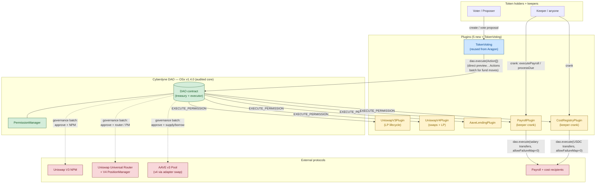

> **On the governance path** (the `dao.execute(Action[])` arrow above): for fund-moving ops on UniswapV3 / UniswapV4 / AAVE, the proposal bundles the **raw `Action[]` returned by `preview…Actions(...)`** instead of a single-action `dao.execute([{to: plugin, data: swap(...)}])`. That avoids nested `dao.execute` (which would trip OSx's `nonReentrant` guard). The plugin wrappers (`swap`, `mint`, `supply`, …) remain callable directly (tests, alternate governance plugins). See [TRD §9a](docs/TRD.md#9a-governance-path-action-builders-previewactions). Payroll + CostRegistry skip this entirely — their fund-moving entry points are keeper-callable, not vote-gated.

| Color  | Meaning                                                      |
| ------ | ------------------------------------------------------------ |
| Green  | Halborn-audited Aragon OSx v1.4.0 — we don't touch it        |
| Blue   | Existing audited Aragon plugin — we install but don't modify |
| Yellow | New code in this repo — we own and audit it                  |
| Red    | Third-party protocols we integrate with via calldata         |

---

## Why Aragon OSx?

Building a DAO from scratch means rebuilding (and re-auditing) treasury custody, permission management, proposal lifecycle, plugin distribution, and upgrade paths. Aragon OSx ships all of that, fully audited, and lets us add only what's unique to our use case.

| Concern                                                                                   | Provided by OSx                                 | We build                                                                                                                                 |
| ----------------------------------------------------------------------------------------- | ----------------------------------------------- | ---------------------------------------------------------------------------------------------------------------------------------------- |
| Treasury custody (ETH + ERC20 + NFTs)                                                     | `DAO.sol`                                       | —                                                                                                                                        |
| Permission system (grant / revoke / conditions)                                           | `PermissionManager.sol`                         | —                                                                                                                                        |
| Proposal lifecycle + voting                                                               | `aragon/token-voting-plugin`                    | —                                                                                                                                        |
| Plugin install / update / uninstall                                                       | `PluginSetupProcessor` + `PluginRepo`           | —                                                                                                                                        |
| Versioned plugin distribution                                                             | `PluginRepoFactory`                             | —                                                                                                                                        |
| Action execution model                                                                    | `Action{to, value, data}` + `execute(Action[])` | —                                                                                                                                        |
| Uniswap V4 swap gating                                                                    | —                                               | `UniswapV4Plugin` (swap path)                                                                                                            |
| Uniswap V4 LP lifecycle                                                                   | —                                               | `UniswapV4Plugin` (LP path — mint/increase/decrease/burn via v4-periphery PositionManager)                                               |
| Uniswap V3 LP lifecycle                                                                   | —                                               | `UniswapV3Plugin` (mint/increase/decrease/collect/burn via NonfungiblePositionManager)                                                   |
| AAVE lending gating                                                                       | —                                               | `AaveLendingPlugin` + version adapter                                                                                                    |
| Monthly payroll automation                                                                | —                                               | `PayrollPlugin`                                                                                                                          |
| Recurring operating-cost registry + payout                                                | —                                               | `CostRegistryPlugin`                                                                                                                     |
| Governance-safe action batches (avoids nested `dao.execute` reentrancy under TokenVoting) | —                                               | `preview…Actions` view helpers on each fund-moving plugin — see [TRD §9a](docs/TRD.md#9a-governance-path-action-builders-previewactions) |

**Version pinning:** OSx v1.4.0 audited core (`ProtocolVersion == [1, 4, 0]`). Working tree may be tag v1.5.0 because its core is byte-identical to 1.4.0. No forks, no patches, no custom flavors. See [TRD §3](docs/TRD.md#3-aragon-osx-version-policy).

---

## Plugin overview

> **For a capability-first tour — every feature, real-world use cases, and per-plugin flow diagrams — see [`docs/plugins/FEATURES.md`](docs/plugins/FEATURES.md).** The sections below are the architectural summary; the spec files in [`docs/plugins/`](docs/plugins/) carry exact signatures, storage layouts, and slither waivers.

### 1. Uniswap V4 Plugin (swaps + LP)

**Swap — governance path** (the `preview…Actions` pattern, see [TRD §9a](docs/TRD.md#9a-governance-path-action-builders-previewactions)):

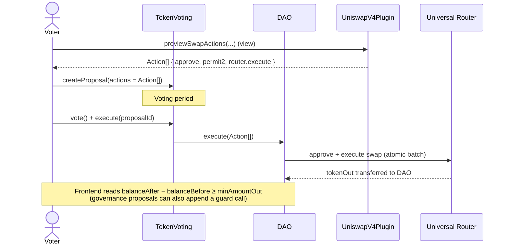

**LP — `modifyLiquidities` pass-through** (mint / increase / decrease / collect / burn):

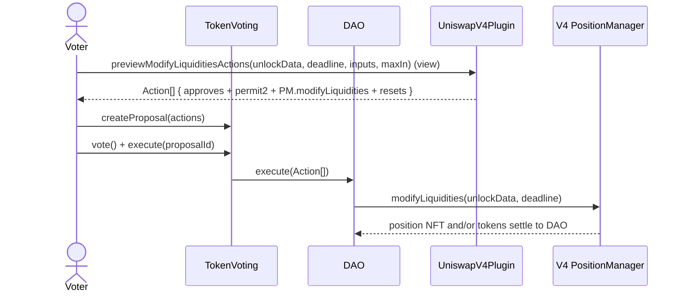

- Plugin holds no funds, no NFTs — DAO is `msg.sender` to the router and PM.
- Allowlist (optional) gates `tokenIn`/`tokenOut` for swaps and every input/output currency for LP ops.
- **Native ETH (`address(0)`) is a first-class currency** on both paths — ETH-in swaps and native-ETH LP inputs are funded via `value` (no Permit2/approve), and native outputs are slippage-checked against the DAO's ether balance — so real ETH/x pools work, not just WETH/x. See [`docs/plugins/UNISWAP_V4.md §4a`](docs/plugins/UNISWAP_V4.md).
- Direct wrapper calls (`swap`, `modifyLiquidities`) still work for tests and alternate governance plugins — they just can't be invoked through TokenVoting because of OSx's `nonReentrant` `DAO.execute`.

### 2. Uniswap V3 Plugin (full LP lifecycle)

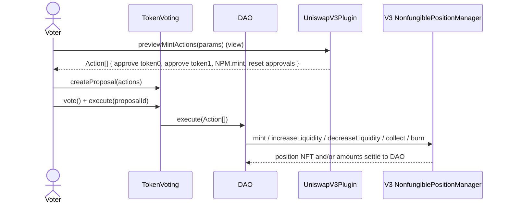

- Same preview-based governance pattern as V4.
- Position NFTs are always minted with `recipient = DAO`; collect target is forced to the DAO.
- `previewMintActions`, `previewIncreaseLiquidityActions`, `previewDecreaseLiquidityActions`, `previewCollectActions`, `previewBurnActions` cover the full lifecycle.

### 3. AAVE Lending Plugin

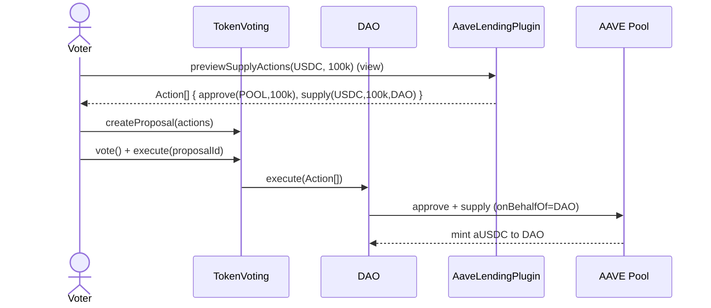

- v3 today via `AaveV3Adapter`; v4 later via vote to `setAdapter(newAdapter)`.
- `onBehalfOf = DAO` for every call — aTokens and debt tokens always issued to the DAO.
- Supply, withdraw, borrow, repay — each gated by vote, each shipped with a `preview…Actions` view helper for the governance path.

### 4. Payroll Plugin (auto-execution)

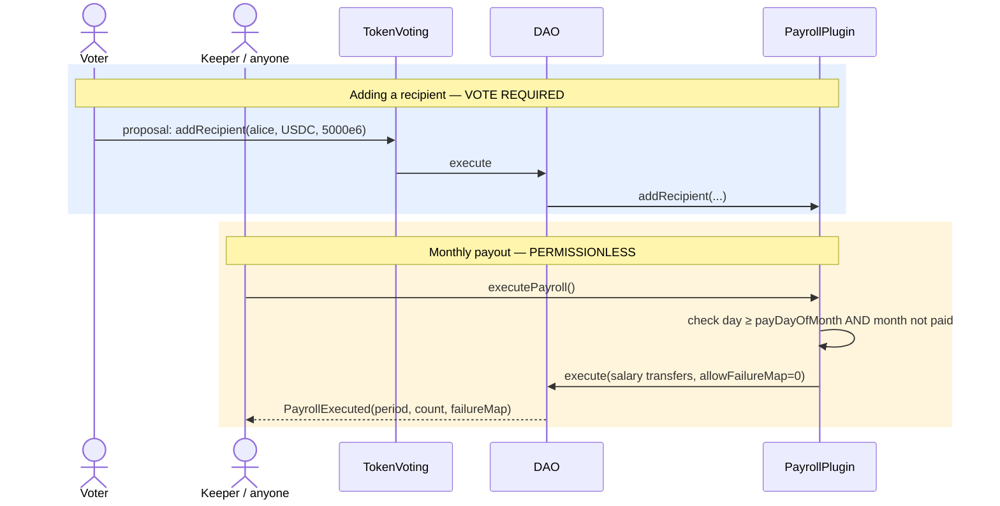

- **Vote required** for: adding / removing / reactivating recipients, changing amounts, changing the pay day.
- **No vote required** for the monthly payout itself — anyone can call `executePayroll()` on or after `payDayOfMonth` once per month.
- Salary transfers are **mandatory** (`allowFailureMap = 0`): a failing transfer reverts the whole crank and leaves the period open to retry — a period is never marked paid unless every salary in it actually paid (audit H-01). ERC20 payouts route through a SafeERC20 helper so false-returning tokens can't be booked as paid (M-04). Only an optional keeper-bounty leg is failable.
- `payDayOfMonth` constrained to 1–28 to avoid month-length edge cases.
- Calendar math via vendored BokkyPooBah DateTime library.
- Large payrolls paginate via `executePayrollPage` (`MAX_RECIPIENTS_PER_PAGE = 100`, `MAX_RECIPIENTS = 300`); native ETH payees supported (`token = address(0)`).
- Optional **keeper bounty** (`setKeeperBounty`, vote-gated): pays the crank caller a capped ETH/ERC20 bounty so keepers are incentivized on high-gas days.

### 5. CostRegistry Plugin (recurring operating costs)

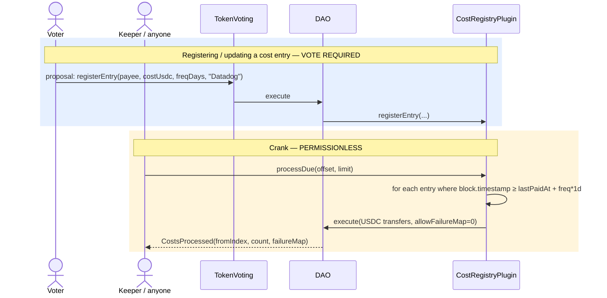

- Each entry pays a fixed USDC amount on its own recurring cadence (`frequencyDays`).
- Entries pay **independently** by `lastPaidAt + frequencyDays` (no shared period).
- Keeper-callable cranks: `processDue(offset, limit)` (explicit window), `processAllDue()` (single-page registries; reverts if the registry exceeds one page), and `processDueFromCursor(limit)` (round-robin coverage of large registries).
- Same mandatory-transfer semantics as Payroll (audit H-03): the crank runs with `allowFailureMap = 0`, so a failed transfer reverts the batch and rolls back `lastPaidAt` — no entry is ever marked paid for a payment that didn't happen. Payments route through the same SafeERC20 helper (CR-M-01).
- Per-payment cap (`MAX_COST_USDC`) guards against typo'd amounts; the payment token is migratable via the vote-gated `setPaymentToken` (rejects a decimals mismatch — CR-M-02).

---

## Trust & audit boundary

```mermaid
flowchart LR
    subgraph A["Aragon-audited (Halborn 1.4.0)"]
        DAO[DAO.sol]
        PM[PermissionManager]
        DF[DAOFactory]
        PSP[PluginSetupProcessor]
        PR[PluginRepo*]
        TV[TokenVoting + GovernanceERC20]
    end

    subgraph B["Our scope (to be audited)"]
        U3[UniswapV3Plugin + Setup]
        U4[UniswapV4Plugin + Setup]
        L[AaveLendingPlugin + Setup + Adapters]
        P[PayrollPlugin + Setup]
        C[CostRegistryPlugin + Setup]
    end

    A -.->|consumed by| B

    style A fill:#d4edda,stroke:#155724
    style B fill:#fff3cd,stroke:#856404
```

Every line of new code in this repo lives in B (yellow). The green side is consumed as-is. Audit scope therefore = 5 plugins + their setup contracts + the bootstrap script. Nothing more.

---

## Tooling stack

| Layer              | Tool                                            | Why                                                                                                                         |
| ------------------ | ----------------------------------------------- | --------------------------------------------------------------------------------------------------------------------------- |
| Solidity build     | **Foundry** (`forge`)                           | Matches OSx upstream (`solc 0.8.17`, `optimizer-runs = 2000`). Fast compile + storage layout.                               |
| Tests              | **Hardhat + TypeScript + ethers v5**            | Native fork support (`hardhat_reset`, `hardhat_impersonateAccount`), time travel, mocha/chai matchers from `chai-setup.ts`. |
| Deployment scripts | **Foundry** (`forge script` via `just-foundry`) | Aligned with OSx `DEPLOYMENT.md` convention.                                                                                |
| Fork engine        | **Hardhat Network forking**                     | One config flips between Ethereum / Base / other supported networks.                                                        |
| Type bindings      | `@typechain/hardhat`                            | Generated for both our plugins and Aragon / Uniswap / AAVE ABIs.                                                            |
| Coverage           | `solidity-coverage`                             | CI gate ≥ 90 % on new code.                                                                                                 |
| Lint / format      | `solhint` + `prettier-plugin-solidity`          | Same configs as OSx upstream.                                                                                               |

### Fork networks

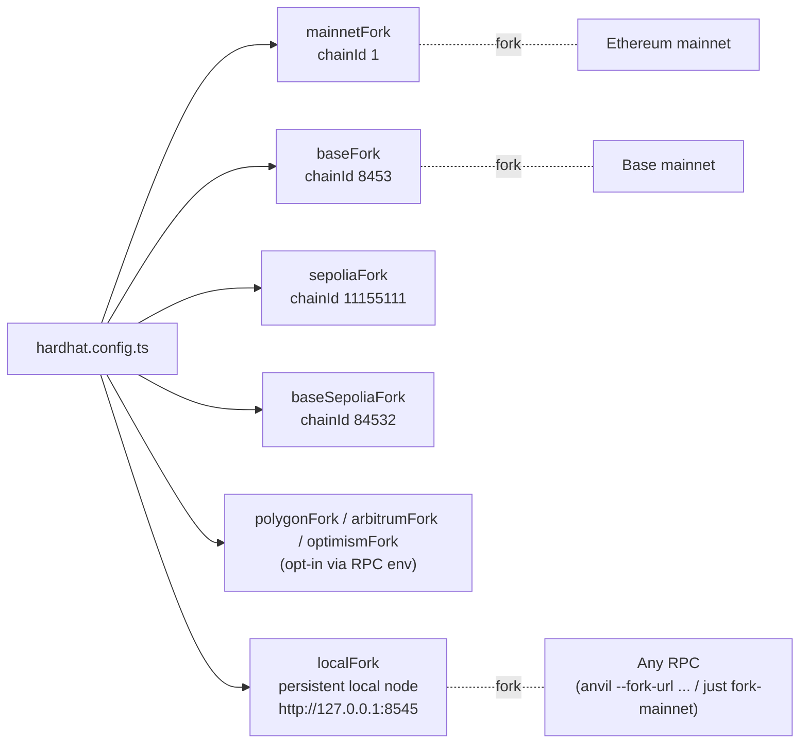

`addresses.json` from `npm-artifacts/` is the source of truth for deployed OSx addresses per chainId. Tests read it at setup so they auto-target the right factories per fork.

---

## Bootstrap flow

The entire DAO + 5 plugins comes up in a **single transaction**:

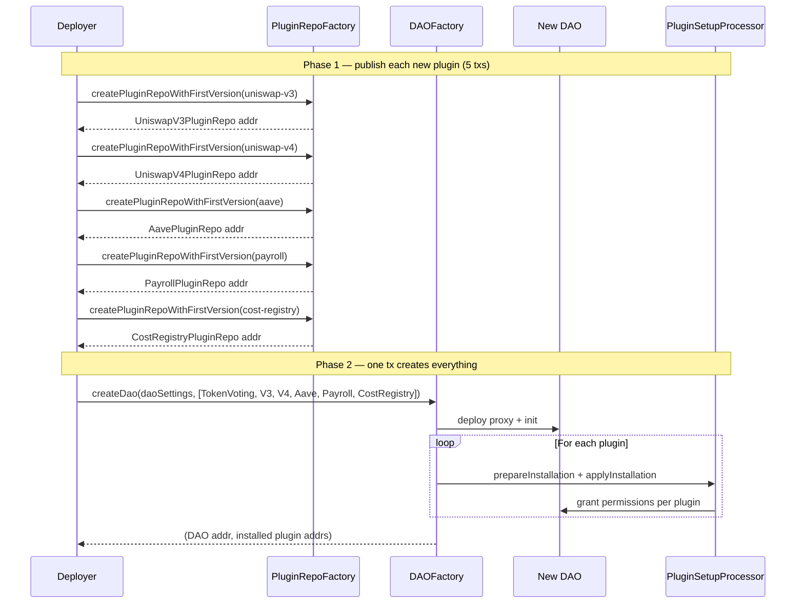

---

## Repository layout (planned)

```
cyberdyne_dao_contracts/
├── README.md                      ← you are here
├── docs/
│   └── TRD.md                     ← full Technical Requirements Document
├── src/                           ← Solidity sources
│   └── plugins/
│       ├── uniswap-v4/
│       │   ├── UniswapV4Plugin.sol
│       │   └── UniswapV4PluginSetup.sol
│       ├── aave/
│       │   ├── AaveLendingPlugin.sol
│       │   ├── AaveLendingPluginSetup.sol
│       │   └── adapters/{IAaveAdapter, AaveV3Adapter, AaveV4Adapter}.sol
│       └── payroll/
│           ├── PayrollPlugin.sol
│           ├── PayrollPluginSetup.sol
│           └── lib/BokkyPooBahDateTime.sol
├── test/                          ← Hardhat + TypeScript
│   ├── helpers/{fork-guard,addresses,impersonate,time}.ts
│   ├── plugins/{uniswap-v4,aave,payroll}/*.{unit,fork}.test.ts
│   └── e2e/CustomDaoBootstrap.fork.test.ts
├── scripts/                       ← Foundry deploy scripts
│   ├── DeployUniswapV4Plugin.s.sol
│   ├── DeployAavePlugin.s.sol
│   ├── DeployPayrollPlugin.s.sol
│   └── DeployCyberdyneDao.s.sol
├── frontend/                      ← Toy frontend (Svelte + ethers.js + WalletConnect)
│   ├── src/
│   │   ├── routes/                (SvelteKit pages: dao, proposals, payroll, lending, swaps)
│   │   ├── lib/                   (wallet, contracts, abi loaders)
│   │   └── app.html
│   ├── static/
│   ├── package.json
│   ├── svelte.config.js
│   ├── vite.config.ts
│   └── README.md
├── lib/                           ← Foundry deps (OSx submodule, OZ, forge-std)
├── foundry.toml
├── hardhat.config.ts
├── remappings.txt
├── package.json
└── tsconfig.json
```

---

## Getting started

```bash
# Clone with submodules (OSx + osx-commons + OZ + forge-std)
git clone --recurse-submodules https://github.com/CyberdyneCorp/cyberdyne_dao_contracts.git
cd cyberdyne_dao_contracts

# Install Foundry if you don't have it
curl -L https://foundry.paradigm.xyz | bash && foundryup

# Install npm deps + build the package artifacts the frontend consumes
npm install --legacy-peer-deps
just build-package         # forge + hardhat compile + ABIs + addresses.json

# Test (every command below has a `just` recipe; see `just --list`)
just test                  # full Hardhat suite (222 unit + 40 fork specs)
just invariants            # 25 Foundry invariants, 50k sequences (CI profile)

# Fork tests: start a fork in one terminal, run the *.fork suites in another.
# RPC_MAINNET is read from .env.
just fork-mainnet          # Terminal 1 — anvil fork on :8545
just test-fork mainnetFork # Terminal 2 — runs the *.fork + e2e suites
```

Required env vars (see `.env.example`):

```
RPC_MAINNET=
RPC_BASE=
RPC_SEPOLIA=
RPC_BASE_SEPOLIA=
DEPLOYER_KEY=               # burner wallet — never a primary key
ETHERSCAN_API_KEY=
PIN_MAINNET=                # optional — block number to pin fork to (CI determinism)
PIN_BASE=
```

---

## Run the full local stack

**→ See [`docs/LOCAL_STACK.md`](docs/LOCAL_STACK.md)** for the complete walkthrough — clone → install → local fork → deploy DAO → frontend → MetaMask → executed payroll, in one self-contained document with troubleshooting. ~5 minutes once you have the prereqs.

Skipped below: the long-form recipe. Kept inline only as a TL;DR for skim-readers.

<details>
<summary>TL;DR (5 commands)</summary>

```bash
# 1. Clone + install (Terminal 0).
git clone --recurse-submodules https://github.com/CyberdyneCorp/cyberdyne_dao_contracts.git
cd cyberdyne_dao_contracts && npm install --legacy-peer-deps && npm run build:package

# 2. Local mainnet fork (Terminal 1). RPC_MAINNET is read from .env.
#    Uses anvil (not `hardhat node`, which can't set --chain-id). Append a
#    block number to pin: `just fork-mainnet 21500000`.
just fork-mainnet

# 3. Deploy the DAO (Terminal 2). Broadcasts with anvil's well-known account #0.
just deploy-local

# 4. Toy frontend (Terminal 3).
just frontend-install && cp frontend/.env.example frontend/.env.local
# edit .env.local: PUBLIC_RPC_MAINNET=http://127.0.0.1:8545, PUBLIC_DAO_MAINNET=<dao>,<payroll>,<uniswap>,<aave>
just frontend-dev

# 5. In MetaMask: add custom net at 127.0.0.1:8545 / chainId 1, import deployer key, Connect injected on the UI.
```

</details>

---

## Frontend

Two UIs, two scopes:

|         | Production UI                              | Toy frontend (in this repo)                       |
| ------- | ------------------------------------------ | ------------------------------------------------- |
| Where   | Sibling repository                         | `frontend/` directory here                        |
| Stack   | Project-chosen (e.g. React + wagmi + viem) | Svelte + ethers.js v5 + WalletConnect v2          |
| Purpose | End-user DAO operation                     | Dev / audit / testnet inspection + manual testing |
| Polish  | Full design system                         | None — default Svelte components only             |
| Spec    | TRD §3a                                    | TRD §3b                                           |

The toy frontend exists so developers, auditors, and testnet bug-bounty participants can interact with every plugin action end-to-end without depending on the production UI being ready. It connects to `localFork`, `mainnetFork`, `baseFork`, `sepoliaFork`, `baseSepoliaFork`, and live networks via a chain switcher driven by `addresses.json`. See [TRD §3b](docs/TRD.md#3b-toy-frontend-in-repo-devtest-tool) for full scope; built in roadmap [P6](docs/ROADMAP.md#phase-6--toy-frontend-in-repo-devtest-tool).

The Aragon App is explicitly **not** a deployment target for either UI.

The contracts in this repo are responsible for:

- Emitting granular events (`SwapExecuted`, `Supplied`, `RecipientAdded`, `PayrollExecuted`, …) for both UIs + subgraph.
- Stable external signatures for clean TypeChain bindings.
- Batch-friendly view functions (one RPC round-trip per UI screen where reasonable).
- Publishing a `frontend-abi/` artifact at release time — must include plain JSON ABIs (consumable by the Svelte toy frontend) **and** TypeChain types (consumable by the production UI).

---

## Documentation index

| Doc                                                                    | Purpose                                                                                                                                          |
| ---------------------------------------------------------------------- | ------------------------------------------------------------------------------------------------------------------------------------------------ |
| [README.md](README.md)                                                 | This file — overview, architecture, getting started TL;DR.                                                                                       |
| [docs/LOCAL_STACK.md](docs/LOCAL_STACK.md)                             | Self-contained local dev runbook: clone → fork → deploy → frontend → MetaMask → executed payroll.                                                |
| [docs/FRONTEND_INTEGRATION.md](docs/FRONTEND_INTEGRATION.md)           | How any custom UI (production app, third-party) consumes the contracts — npm pkg, subgraph, IPFS, read/write patterns.                           |
| [docs/EVENTS.md](docs/EVENTS.md)                                       | Every event → UI surface → subgraph entity mapping.                                                                                              |
| [docs/PROPOSAL_METADATA.md](docs/PROPOSAL_METADATA.md)                 | IPFS proposal-metadata schema + pinning recipe.                                                                                                  |
| [docs/THREAT_MODEL.md](docs/THREAT_MODEL.md)                           | Asset enumeration, trust boundaries, 20-vector mitigation table.                                                                                 |
| [docs/INTERNAL_REVIEW_CHECKLIST.md](docs/INTERNAL_REVIEW_CHECKLIST.md) | Per-plugin signoff template (≥2 contributors per plugin before external audit).                                                                  |
| [docs/reviews/](docs/reviews/)                                         | P8 internal review sign-off records (two independent approvals per plugin) gating the external audit.                                            |
| [audits/external/SCOPE.md](audits/external/SCOPE.md)                   | **External audit scope letter** (Phase 9): in-scope files, out-of-scope deps, trust model, accepted risks, pinned to `v0.9.0-rc1`.               |
| [docs/plugins/FEATURES.md](docs/plugins/FEATURES.md)                   | **Plugin features & use cases** — per-plugin capability tour, real-world scenarios, and mermaid flows for all 5 plugins. Start here.             |
| [docs/plugins/PAYROLL.md](docs/plugins/PAYROLL.md)                     | PayrollPlugin spec + slither waivers + storage layout.                                                                                           |
| [docs/plugins/UNISWAP_V4.md](docs/plugins/UNISWAP_V4.md)               | UniswapV4Plugin spec + slither waivers + storage layout.                                                                                         |
| [docs/plugins/UNISWAP_V3.md](docs/plugins/UNISWAP_V3.md)               | UniswapV3Plugin spec + slither waivers + storage layout.                                                                                         |
| [docs/plugins/AAVE.md](docs/plugins/AAVE.md)                           | AaveLendingPlugin spec + slither waivers + storage layout.                                                                                       |
| [docs/plugins/COST_REGISTRY.md](docs/plugins/COST_REGISTRY.md)         | CostRegistryPlugin spec + slither waivers + storage layout.                                                                                      |
| [docs/storage-layouts/](docs/storage-layouts/)                         | `forge inspect` storage-layout snapshots per release for upgrade-safety diffing.                                                                 |
| [docs/TRD.md](docs/TRD.md)                                             | Full Technical Requirements Document. Source of truth for every design decision, permission grant, address, deployment phase, and open question. |
| [docs/ROADMAP.md](docs/ROADMAP.md)                                     | End-to-end project roadmap: 13 phases with deliverables, exit criteria, and the project-wide quality bars.                                       |
| [subgraph/README.md](subgraph/README.md)                               | Per-DAO subgraph deploy recipe (Goldsky / hosted Graph / Studio).                                                                                |
| [frontend/README.md](frontend/README.md)                               | Toy frontend quickstart + the in-repo views/actions inventory.                                                                                   |

---

## Roadmap

Full phase-by-phase plan with deliverables and exit criteria: **[`docs/ROADMAP.md`](docs/ROADMAP.md)**.

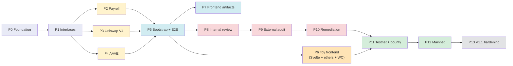

**Project-wide quality bars** (enforced in CI on every PR — see [ROADMAP §"Project-wide quality bars"](docs/ROADMAP.md#project-wide-quality-bars-non-negotiable)):

- **≥ 90 % unit-test coverage** on lines AND branches for all files under `src/plugins/**`, enforced by `solidity-coverage`.
- **Integration tests are Hardhat fork tests** against real deployed networks. Every plugin has `*.fork.test.ts` running on `mainnetFork` and `baseFork` minimum.
- **Local dev = persistent fork of live network** via `just fork-mainnet` (`anvil --fork-url $RPC_MAINNET --chain-id 1`) — gives sub-second feedback against mainnet state with `anvil_impersonateAccount` / `hardhat_impersonateAccount` for spoofing whales / DAO.
- **CI matrix runs fork tests in parallel** on Ethereum + Base; other Aragon-supported chains opt-in via `RPC_<NAME>` secrets.
- **Block pinning in CI** (`PIN_MAINNET`, `PIN_BASE`) for deterministic runs; local dev runs unpinned for freshness.
- **`solc 0.8.17` + `optimizer-runs = 2000`** identical to Aragon OSx v1.4.0 audited bytecode.

Engineering estimate: ~3–4 weeks of dev work to mainnet-ready code (P0–P5), then ~5–8 weeks of calendar time for review, audit, remediation, testnet bounty period, mainnet ceremony (P6–P11). See [ROADMAP](docs/ROADMAP.md) for per-phase day estimates.

---

## License

TBD — to be set before any code is committed.

## Security

This repo does not yet contain deployable code. When it does, vulnerability reports go to TBD.
