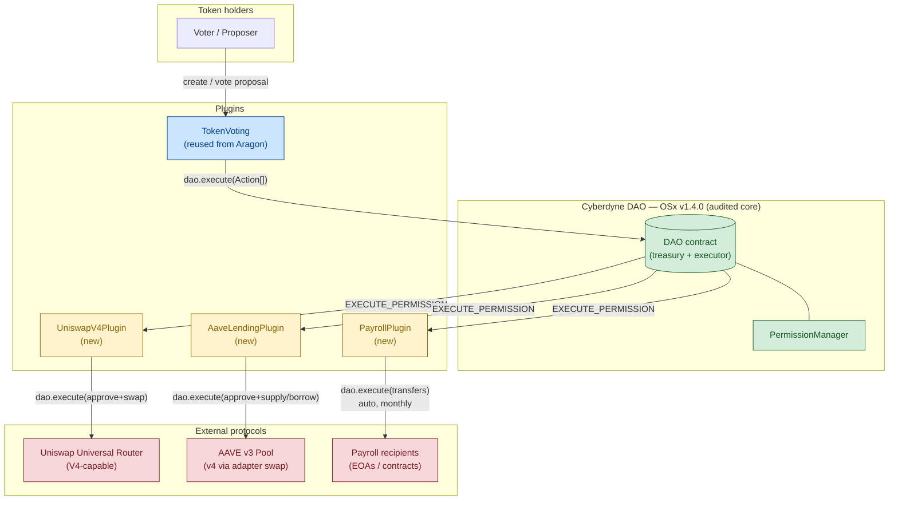
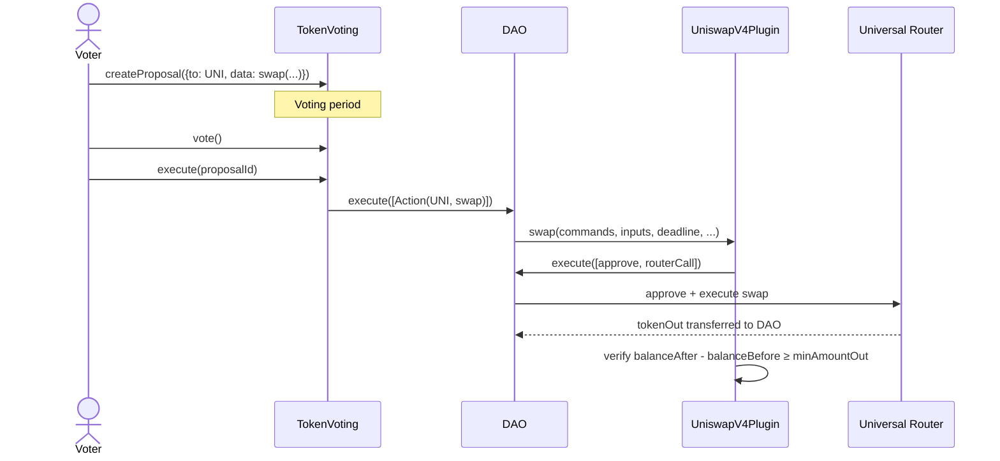
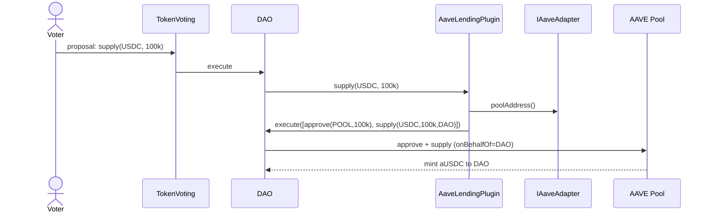
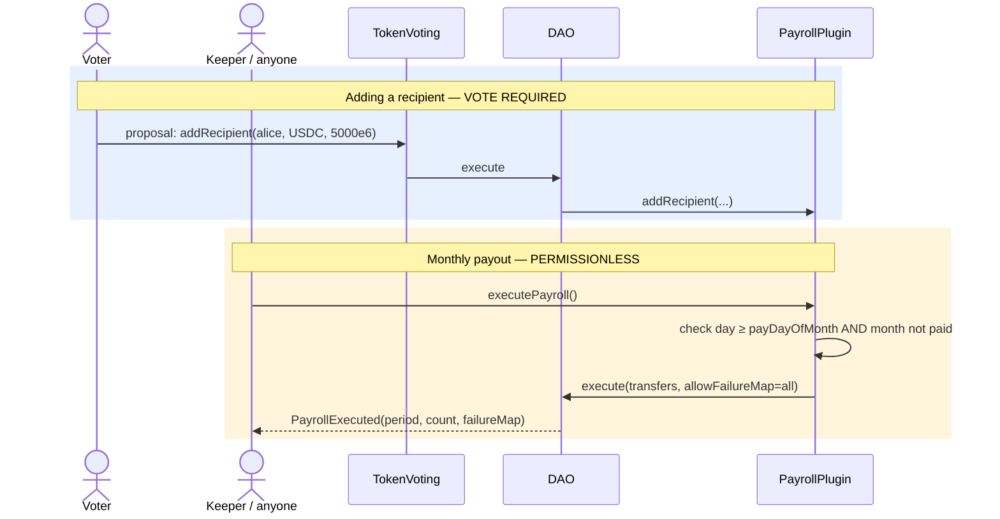
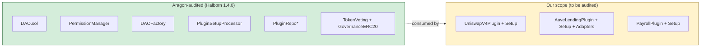
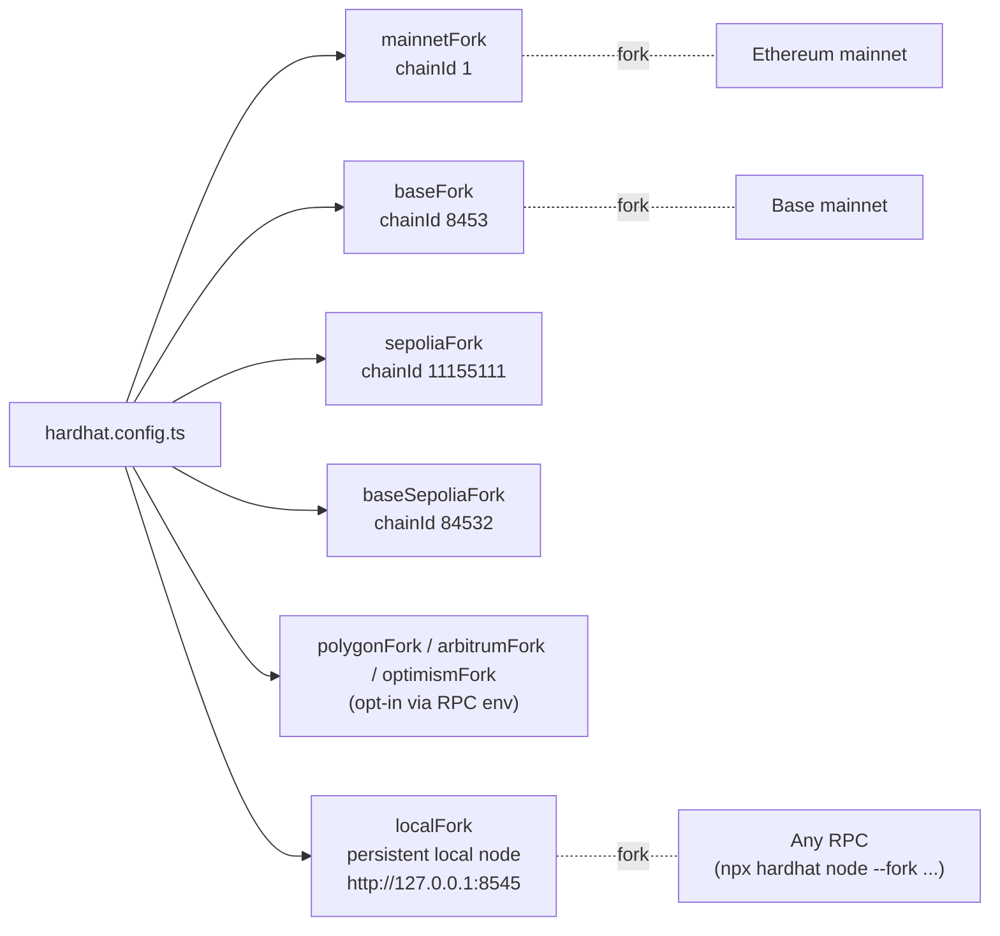
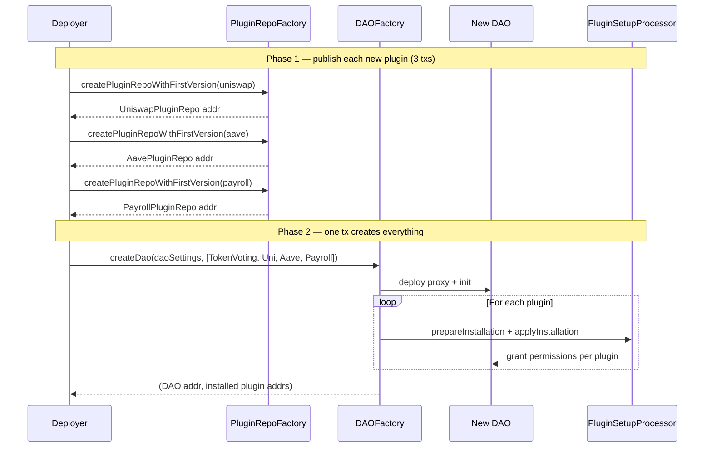

# Cyberdyne DAO — Contracts

On-chain governance for the Cyberdyne DAO, built on top of the audited [Aragon OSx](https://github.com/aragon/osx) protocol with custom plugins for Uniswap V4 trading, AAVE lending, and automated monthly payroll.

> **Status:** Documentation / planning phase. Contracts not yet implemented. See [`docs/TRD.md`](docs/TRD.md) for the full Technical Requirements Document.

---

## TL;DR

- We **do not fork** Aragon OSx. We deploy a single DAO on top of the audited OSx v1.4.0 core (Halborn-audited) and install our own plugins.
- We build **three plugins**: `UniswapV4Plugin`, `AaveLendingPlugin`, `PayrollPlugin`.
- Token-weighted voting gates every privileged action (swaps, lending, payroll changes). The DAO itself holds all funds — plugins never custody.
- Payroll executes **automatically** on a fixed day of the month via a permissionless crank. Adding or removing payroll recipients requires a vote.
- Tooling: **Foundry** for build/deploy, **Hardhat + TypeScript** for tests with mainnet/Base fork mode.
- UX layer: **our own custom UI** (separate repo). The Aragon App is explicitly not a deployment target.

---

## High-level architecture



| Color | Meaning |
|---|---|
| Green | Halborn-audited Aragon OSx v1.4.0 — we don't touch it |
| Blue | Existing audited Aragon plugin — we install but don't modify |
| Yellow | New code in this repo — we own and audit it |
| Red | Third-party protocols we integrate with via calldata |

---

## Why Aragon OSx?

Building a DAO from scratch means rebuilding (and re-auditing) treasury custody, permission management, proposal lifecycle, plugin distribution, and upgrade paths. Aragon OSx ships all of that, fully audited, and lets us add only what's unique to our use case.

| Concern | Provided by OSx | We build |
|---|---|---|
| Treasury custody (ETH + ERC20 + NFTs) | `DAO.sol` | — |
| Permission system (grant / revoke / conditions) | `PermissionManager.sol` | — |
| Proposal lifecycle + voting | `aragon/token-voting-plugin` | — |
| Plugin install / update / uninstall | `PluginSetupProcessor` + `PluginRepo` | — |
| Versioned plugin distribution | `PluginRepoFactory` | — |
| Action execution model | `Action{to, value, data}` + `execute(Action[])` | — |
| Uniswap V4 swap gating | — | `UniswapV4Plugin` |
| AAVE lending gating | — | `AaveLendingPlugin` + version adapter |
| Monthly payroll automation | — | `PayrollPlugin` |

**Version pinning:** OSx v1.4.0 audited core (`ProtocolVersion == [1, 4, 0]`). Working tree may be tag v1.5.0 because its core is byte-identical to 1.4.0. No forks, no patches, no custom flavors. See [TRD §3](docs/TRD.md#3-aragon-osx-version-policy).

---

## Plugin overview

### 1. Uniswap V4 Plugin



- Every swap requires a passed proposal.
- Plugin builds a 3-action atomic batch (approve → swap → revoke).
- Slippage enforced by post-swap balance delta check inside the plugin.
- Output tokens land directly in the DAO.

### 2. AAVE Lending Plugin



- v3 today via `AaveV3Adapter`; v4 later via vote to `setAdapter(newAdapter)`.
- `onBehalfOf = DAO` for every call — aTokens and debt tokens always issued to the DAO.
- Supply, withdraw, borrow, repay — each gated by vote.

### 3. Payroll Plugin (auto-execution)



- **Vote required** for: adding / removing recipients, changing amounts, changing the pay day.
- **No vote required** for the monthly payout itself — anyone can call `executePayroll()` on or after `payDayOfMonth` once per month.
- Failed individual transfers don't block the rest (per-action `allowFailureMap`).
- `payDayOfMonth` constrained to 1–28 to avoid month-length edge cases.
- Calendar math via vendored BokkyPooBah DateTime library.

---

## Trust & audit boundary



Every line of new code in this repo lives in B (yellow). The green side is consumed as-is. Audit scope therefore = ~3 plugins + their setup contracts + the bootstrap script. Nothing more.

---

## Tooling stack

| Layer | Tool | Why |
|---|---|---|
| Solidity build | **Foundry** (`forge`) | Matches OSx upstream (`solc 0.8.17`, `optimizer-runs = 2000`). Fast compile + storage layout. |
| Tests | **Hardhat + TypeScript + ethers v5** | Native fork support (`hardhat_reset`, `hardhat_impersonateAccount`), time travel, mocha/chai matchers from `chai-setup.ts`. |
| Deployment scripts | **Foundry** (`forge script` via `just-foundry`) | Aligned with OSx `DEPLOYMENT.md` convention. |
| Fork engine | **Hardhat Network forking** | One config flips between Ethereum / Base / other supported networks. |
| Type bindings | `@typechain/hardhat` | Generated for both our plugins and Aragon / Uniswap / AAVE ABIs. |
| Coverage | `solidity-coverage` | CI gate ≥ 90 % on new code. |
| Lint / format | `solhint` + `prettier-plugin-solidity` | Same configs as OSx upstream. |

### Fork networks



`addresses.json` from `npm-artifacts/` is the source of truth for deployed OSx addresses per chainId. Tests read it at setup so they auto-target the right factories per fork.

---

## Bootstrap flow

The entire DAO + 4 plugins comes up in a **single transaction**:



---

## Repository layout (planned)

```
cyberdyne_dao_contracts/
├── README.md                      ← you are here
├── docs/
│   └── TRD.md                     ← full Technical Requirements Document
├── src/                           ← Solidity sources
│   └── plugins/
│       ├── uniswap-v4/
│       │   ├── UniswapV4Plugin.sol
│       │   └── UniswapV4PluginSetup.sol
│       ├── aave/
│       │   ├── AaveLendingPlugin.sol
│       │   ├── AaveLendingPluginSetup.sol
│       │   └── adapters/{IAaveAdapter, AaveV3Adapter, AaveV4Adapter}.sol
│       └── payroll/
│           ├── PayrollPlugin.sol
│           ├── PayrollPluginSetup.sol
│           └── lib/BokkyPooBahDateTime.sol
├── test/                          ← Hardhat + TypeScript
│   ├── helpers/{fork-guard,addresses,impersonate,time}.ts
│   ├── plugins/{uniswap-v4,aave,payroll}/*.{unit,fork}.test.ts
│   └── e2e/CustomDaoBootstrap.fork.test.ts
├── scripts/                       ← Foundry deploy scripts
│   ├── DeployUniswapV4Plugin.s.sol
│   ├── DeployAavePlugin.s.sol
│   ├── DeployPayrollPlugin.s.sol
│   └── DeployCyberdyneDao.s.sol
├── lib/                           ← Foundry deps (OSx submodule, OZ, forge-std)
├── foundry.toml
├── hardhat.config.ts
├── remappings.txt
├── package.json
└── tsconfig.json
```

---

## Getting started

> Once contracts are implemented. Currently this is a documentation-only repo.

```bash
# Clone with submodules (OSx is a submodule, pinned to v1.5.0)
git clone --recurse-submodules https://github.com/CyberdyneCorp/cyberdyne_dao_contracts.git
cd cyberdyne_dao_contracts

# Install deps
forge install
npm install

# Build
forge build              # Foundry build
npx hardhat compile      # Hardhat build (for tests + TypeChain)

# Test
npx hardhat test                                    # unit tests
npx hardhat test --network mainnetFork              # fork tests against Ethereum
npx hardhat test --network baseFork                 # fork tests against Base

# Local persistent fork (great for iteration)
npx hardhat node --fork $RPC_MAINNET                # terminal 1
npx hardhat test --network localFork                # terminal 2
```

Required env vars (see `.env.example` when scaffolded):

```
RPC_MAINNET=
RPC_BASE=
RPC_SEPOLIA=
RPC_BASE_SEPOLIA=
DEPLOYER_KEY=               # burner wallet — never a primary key
ETHERSCAN_API_KEY=
PIN_MAINNET=                # optional — block number to pin fork to (CI determinism)
PIN_BASE=
```

---

## Frontend

This DAO is operated through our **own custom UI**, tracked in a sibling repository. The Aragon App is explicitly **not** a deployment target. See [TRD §3a](docs/TRD.md#3a-frontend--ux-policy-custom-ui-only).

The contracts in this repo are responsible for:
- Emitting granular events (`SwapExecuted`, `Supplied`, `RecipientAdded`, `PayrollExecuted`, …) for the UI + subgraph.
- Stable external signatures for clean TypeChain bindings.
- Batch-friendly view functions (one RPC round-trip per UI screen where reasonable).
- Publishing a `frontend-abi/` artifact at release time for the UI repo to consume.

---

## Documentation index

| Doc | Purpose |
|---|---|
| [README.md](README.md) | This file — high-level overview, diagrams, getting started. |
| [docs/TRD.md](docs/TRD.md) | Full Technical Requirements Document. Source of truth for every design decision, permission grant, address, deployment phase, and open question. |

When the contracts land, additional docs will be added (per-plugin specs, deployment runbook, security model deep-dive, threat model).

---

## Roadmap

- [ ] Scaffolding: `foundry.toml`, `hardhat.config.ts`, OSx submodule, OZ imports, TypeChain wiring.
- [ ] `UniswapV4Plugin` + setup + unit tests + fork tests (mainnet + Base).
- [ ] `AaveLendingPlugin` + v3 adapter + setup + tests.
- [ ] `PayrollPlugin` + setup + tests with `time.setNextBlockTimestamp` multi-month scenarios.
- [ ] `DeployCyberdyneDao.s.sol` bootstrap script + e2e fork test on mainnet, Base, Sepolia.
- [ ] CI matrix: parallel fork test runs on Ethereum + Base.
- [ ] Internal security review.
- [ ] External audit (Halborn or equivalent).
- [ ] Mainnet deployment.
- [ ] Custom UI integration (separate repo).

Estimated engineering: ~3–4 weeks to a fork-tested, mainnet-deployable build, excluding audit. See [TRD §17](docs/TRD.md#17-estimated-effort).

---

## License

TBD — to be set before any code is committed.

## Security

This repo does not yet contain deployable code. When it does, vulnerability reports go to TBD.
