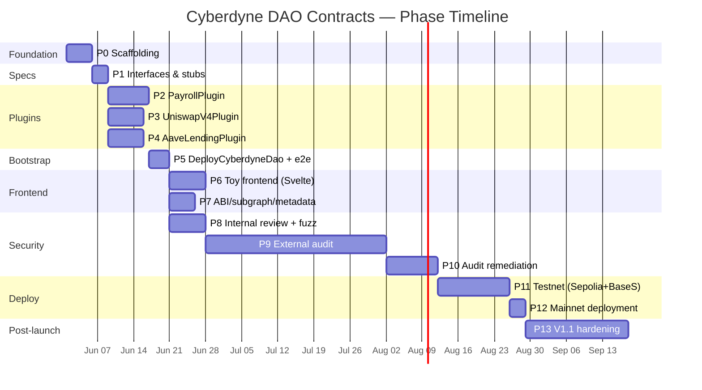
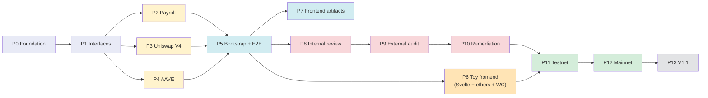

# Cyberdyne DAO Contracts — Project Roadmap

End-to-end plan from empty repo to mainnet-deployed, audited DAO with frontend handoff. Every phase has explicit **deliverables**, **exit criteria**, and a **definition of done** that include the project-wide quality bars below.

## Project-wide quality bars (non-negotiable)

These gates apply to **every** phase that produces Solidity. CI fails the PR if any is missed.

| Bar | How it's enforced |
|---|---|
| **Unit-test coverage ≥ 90 %** on lines AND branches for all files under `src/plugins/**` | `solidity-coverage` run in CI; thresholds set in `.solcover.js`. PR check `coverage/plugins ≥ 90%` blocks merge below threshold. |
| **Integration tests are Hardhat fork tests** against real deployed networks (Ethereum mainnet, Base mainnet at minimum; Sepolia + Base Sepolia for staging) | Hardhat connects to a local **anvil** fork via a named `*Fork` network in `hardhat.config.ts`. Every plugin has `*.fork.test.ts` files that exercise it against real OSx, real Uniswap V4 Universal Router, real AAVE v3 Pool. |
| **Local dev = persistent fork of live network** | `just fork-mainnet` runs a long-lived anvil node that mirrors mainnet state and supports `anvil_impersonateAccount`, `anvil_setBalance`, `evm_increaseTime`. Developers run `just test-fork mainnetFork` for feedback against real state while iterating. |
| **CI fork matrix runs in parallel on mainnet + Base** | GitHub Actions job matrix dispatches one runner per fork target. PR must pass on all targets. Other Aragon-supported chains can be opted in via `RPC_<NAME>` secrets without code changes. |
| **Block pinning in CI** | `PIN_MAINNET` / `PIN_BASE` env vars set in CI to fix forks to a stable block per branch — protects against external-protocol drift (Uniswap pool state, AAVE rates). Local dev runs unpinned for freshness. |
| **No `vm.skip`, no commented-out tests, no `it.only`** | Pre-commit + CI lint step (`eslint-plugin-mocha`) rejects these patterns. |
| **Slither static analysis** clean (or explicitly waived per finding) | Slither runs in CI. New high/medium findings block merge. |
| **`solc 0.8.17` + `optimizer-runs = 2000`** identical to Aragon OSx v1.4.0 audited build | Pinned in both `foundry.toml` and `hardhat.config.ts`. |
| **`ProtocolVersion == [1, 4, 0]`** verified at bootstrap | Bootstrap test asserts `IProtocolVersion(daoFactory).protocolVersion()` matches the audited core. Fails fast if the deploy target drifts. |
| **Every state-changing external function emits an event** | Custom UI consumes events directly + via subgraph. Enforced by review checklist. |
| **All deploys logged to `deployments/<chain>-<timestamp>.json`** | `forge script` writes the JSON; CI uploads as artifact. |

---

## Phase map at a glance





---

## Phase 0 — Foundation & Scaffolding

**Duration estimate:** 3–5 days. **Blocks:** everything.

Set up the empty repo so the dual Foundry + Hardhat pipeline works end-to-end against an empty contract.

**Deliverables**
- `foundry.toml` — `solc 0.8.17`, `optimizer-runs = 2000`, `extra_output = ["storageLayout"]`, `fs_permissions` for `./deployments`.
- `remappings.txt` — `@aragon/...`, `@openzeppelin/...`, `@uniswap/...`, `@aave/...`, `forge-std/`.
- `hardhat.config.ts` — same compiler settings; `networks: { mainnetFork, baseFork, sepoliaFork, baseSepoliaFork, localFork }` (each pointing at a local anvil fork) plus live nets; TypeChain output to `typechain-types/`.
- `lib/` — Foundry submodules: `aragon/osx` pinned at `v1.5.0`, `openzeppelin-contracts(-upgradeable)`, `forge-std`, Uniswap V4 periphery, AAVE v3 origin (for interfaces only).
- `package.json` — `hardhat`, `@nomicfoundation/hardhat-toolbox`, `@nomicfoundation/hardhat-network-helpers`, `@typechain/hardhat`, `ethers@5`, `chai`, `solidity-coverage`, `solhint`, `prettier-plugin-solidity`.
- `.env.example` — `RPC_MAINNET`, `RPC_BASE`, `RPC_SEPOLIA`, `RPC_BASE_SEPOLIA`, `DEPLOYER_KEY`, `ETHERSCAN_API_KEY`, `BASESCAN_API_KEY`, `PIN_MAINNET`, `PIN_BASE`.
- `.solcover.js` — coverage config; exclude `lib/`, include only `src/plugins/**`; thresholds `lines: 90, functions: 90, branches: 90, statements: 90`.
- `.solhint.json`, `.prettierrc` — match OSx upstream.
- `test/helpers/` — `fork-guard.ts` (`onlyOn(["mainnetFork", "localFork"], ...)`), `addresses.ts` (loads from OSx `npm-artifacts/src/addresses.json`), `impersonate.ts`, `time.ts`.
- `.github/workflows/ci.yml` — jobs: `lint`, `forge-build`, `hardhat-build`, `unit` (no fork), `fork-mainnet`, `fork-base`, `coverage` (gate on ≥90%), `slither`.
- `justfile` — convenience recipes: `just build`, `just test`, `just test-fork`, `just coverage`, `just node` (local fork node).
- Smoke test: an empty `Smoke.t.sol` and `smoke.test.ts` that compile and pass.

**Exit criteria**
- [ ] `forge build` succeeds.
- [ ] `npx hardhat compile` succeeds, TypeChain types generated.
- [ ] `just fork-mainnet` (anvil) starts and serves at `127.0.0.1:8545`.
- [ ] `just test-fork mainnetFork` runs the fork smoke test against the persistent fork.
- [ ] CI passes on a "hello world" PR.
- [ ] Slither runs cleanly (no contracts yet → trivially clean).
- [ ] Coverage gate proven to **fail** when below 90 % (sanity check the gate).

---

## Phase 1 — Interfaces & contract stubs

**Duration estimate:** 2–3 days. **Depends on:** P0.

Lock the external API of every plugin before writing logic, so the frontend team and the auditors can review signatures early.

**Deliverables**
- `src/plugins/uniswap-v4/IUniswapV4Plugin.sol`, `UniswapV4Plugin.sol` (stub, all functions revert with `NotImplemented`).
- `src/plugins/aave/IAaveLendingPlugin.sol`, `AaveLendingPlugin.sol`, `adapters/IAaveAdapter.sol`.
- `src/plugins/payroll/IPayrollPlugin.sol`, `PayrollPlugin.sol`.
- Matching `*PluginSetup.sol` for each, returning the permission set defined in TRD §9 but stubbing the actual deploy logic.
- Event signatures finalized — these are part of the public contract for the UI/subgraph.
- TypeChain bindings regenerated and a `frontend-abi/` build hook in `package.json` (`npm run build:abi`) that dumps the JSON ABIs to a stable location.

**Exit criteria**
- [ ] All stubs compile.
- [ ] Auto-generated TypeChain types cover every plugin's external surface.
- [ ] Event signatures reviewed against TRD §6 spec and against UI team needs.
- [ ] PR includes a `docs/EVENTS.md` table mapping each event → which UI surface consumes it (drives later subgraph schema work).

---

## Phase 2 — PayrollPlugin

**Duration estimate:** 6–8 days. **Depends on:** P1.

Implement first because it has the cleanest internal state and exercises the full vote-gate + permissionless-crank pattern.

**Deliverables**
- `PayrollPlugin.sol` — full implementation per TRD §6.3.
- `PayrollPluginSetup.sol` — `prepareInstallation` / `prepareUninstallation` returning the §9 permission grants.
- `lib/BokkyPooBahDateTime.sol` vendored (BSD license preserved).
- Unit tests (`test/plugins/payroll/PayrollPlugin.unit.test.ts`):
  - Permission gating on each admin function.
  - Recipient lifecycle (add / update / remove / soft-delete preservation).
  - `executePayroll` revert paths (wrong day, already paid this month, no active recipients).
  - `executePayroll` happy path with mocked DAO.
  - Per-recipient failure tolerance (one reverting recipient → others paid; `failureMap` emitted).
- Fork integration tests (`PayrollPlugin.fork.test.ts`) on `mainnetFork` and `baseFork`:
  - Real DAO instance via `DAOFactory`.
  - Real USDC + ETH balances in DAO (seeded via `hardhat_impersonateAccount` from a whale).
  - 3-month time-travel scenario: month 1 succeeds, month 2 skipped (no crank called), month 3 pays only month 3 (no back-pay).
  - Reverting-recipient scenario as a real reverting contract.
- `docs/plugins/PAYROLL.md` — per-plugin spec, calendar-math caveats, keeper integration notes.

**Exit criteria**
- [ ] **Coverage ≥ 90 %** on `src/plugins/payroll/**` (lines + branches).
- [ ] Fork tests pass on `mainnetFork` AND `baseFork` in CI.
- [ ] No `vm.skip` / `it.only` / commented tests.
- [ ] Slither clean.
- [ ] `forge inspect PayrollPlugin storage-layout` checked into review (storage gap verified for upgradeability).

---

## Phase 3 — UniswapV4Plugin

**Duration estimate:** 5–7 days. **Depends on:** P1 (can run in parallel with P2 and P4 if staffed).

**Deliverables**
- `UniswapV4Plugin.sol` — full implementation per TRD §6.1.
- `IUniversalRouter.sol`, `IPermit2.sol` interfaces.
- `UniswapV4PluginSetup.sol`.
- Unit tests:
  - Permission gating.
  - Allowlist edits (add / remove / wildcard).
  - `swap` revert paths (disallowed token, slippage too tight, deadline expired).
  - Router address update path.
- Fork integration tests on `mainnetFork` and `baseFork`:
  - Real Universal Router + Permit2 + PoolManager addresses.
  - DAO swaps USDC → WETH; assert DAO balance delta within slippage bound.
  - Multi-hop V4 swap via real pool.
  - Slippage breach scenario (set `minAmountOut` artificially high → expect revert + no balance change).
  - Verify zero leftover allowance to Permit2 / router after swap.
- `docs/plugins/UNISWAP_V4.md` — per-plugin spec.

**Exit criteria** — same shape as P2 (≥90 % coverage, dual-fork pass, slither clean, storage layout reviewed).

---

## Phase 4 — AaveLendingPlugin + adapters

**Duration estimate:** 5–7 days. **Depends on:** P1.

**Deliverables**
- `AaveLendingPlugin.sol` — full implementation per TRD §6.2.
- `adapters/IAaveAdapter.sol`, `adapters/AaveV3Adapter.sol`.
- `adapters/AaveV4Adapter.sol` — stub returning `NotImplemented`; placeholder so the v3↔v4 swap path is exercised by tests today.
- `AaveLendingPluginSetup.sol`.
- Unit tests:
  - Permission gating.
  - Asset allowlist.
  - `setAdapter` happy path + revert if zero address.
  - Mocked adapter for unit-level supply/withdraw/borrow/repay.
- Fork integration tests on `mainnetFork` and `baseFork` (Base uses AAVE v3 too):
  - Supply USDC → assert aUSDC minted to DAO, plugin holds nothing.
  - Withdraw → assert aUSDC burned, USDC returned to DAO.
  - Borrow USDC against ETH collateral → assert variable-rate debt token issued to DAO; verify health factor pre/post.
  - Repay → assert debt token burned.
  - Adapter swap simulation: deploy a v4-stub-style adapter, vote to swap, prove old supply still readable through `aToken` while new ops go through new adapter.
- `docs/plugins/AAVE.md` — per-plugin spec; document v3→v4 migration playbook.

**Exit criteria** — same shape as P2/P3.

---

## Phase 5 — Bootstrap script + E2E fork tests

**Duration estimate:** 3–4 days. **Depends on:** P2 + P3 + P4.

The first time all five plugins exist in the same DAO.

**Deliverables**
- `scripts/DeployUniswapV4Plugin.s.sol`, `DeployAavePlugin.s.sol`, `DeployPayrollPlugin.s.sol` — each deploys impl + setup + creates its `PluginRepo` via `PluginRepoFactory.createPluginRepoWithFirstVersion`.
- `scripts/DeployCyberdyneDao.s.sol` — calls `DAOFactory.createDao(daoSettings, [TokenVoting, Uniswap, Aave, Payroll])` in a single tx.
- `test/e2e/CustomDaoBootstrap.fork.test.ts` running on `mainnetFork`, `baseFork`, AND `sepoliaFork`:
  - Full bootstrap.
  - Assert `IProtocolVersion(daoFactory).protocolVersion() == [1, 4, 0]`.
  - Assert each permission in TRD §9 is granted.
  - Run one proposal per plugin end-to-end (create → vote → execute) and assert correct state changes.
  - Execute a payroll month and verify recipient balances changed.

**Exit criteria**
- [ ] E2E test passes on all three forks in CI.
- [ ] Single `just deploy-cyberdyne-dao` recipe runs the four publish txs + the bootstrap tx, prints final addresses, writes `deployments/<chain>-<timestamp>.json`.
- [ ] Permission matrix in TRD §9 verified by an automated assertion in the E2E test (catches drift).

---

## Phase 6 — Toy frontend (in-repo dev/test tool)

**Duration estimate:** 5–7 days. **Depends on:** P5. **Can run in parallel with P7 and P8.**

A minimal Svelte + ethers.js + WalletConnect UI living in `frontend/` of this repo. Exists solely to inspect and exercise the DAO during development, audit walkthroughs, and the testnet bug bounty (P11). **Not** the production UI — that lives in a sibling repo, see TRD §3a. Full scope and constraints in TRD §3b.

**Deliverables**
- `frontend/` directory: SvelteKit project, Vite dev server, npm scripts (`dev`, `build`, `preview`, `check`).
- Wallet connectivity: `@walletconnect/ethereum-provider` v2 + injected wallet (MetaMask) fallback. Project ID configured via env.
- Ethereum client: ethers.js v5 (matches the test stack and TypeChain output).
- Network switcher driven by `addresses.json` from the contracts artifact (`localFork`, `mainnetFork`, `baseFork`, `sepoliaFork`, `baseSepoliaFork`, live nets — no code changes per chain).
- **Read views:**
  - DAO overview: treasury balances (ETH + tracked ERC20s), installed plugin addresses, total voting power, `ProtocolVersion`.
  - Proposal list + proposal detail (title/description from IPFS metadata, decoded `Action[]`, vote tallies, status, `canExecute`).
  - Payroll schedule: active recipients, amounts, pay day, next-payout countdown, last-paid period.
  - Lending positions: AAVE supplies (aToken balances), debts (variable + stable), health factor.
  - Swap history: recent `SwapExecuted` events.
- **Write actions** (one minimal form per action):
  - Create proposal (raw `Action[]` paste + plugin-specific helper forms).
  - Vote / execute proposal.
  - Add / remove / update payroll recipient (vote-gated → builds proposal).
  - Trigger `executePayroll()` (permissionless crank — a single button).
  - Update Uniswap router / AAVE adapter / allowlists (vote-gated admin actions).
- Prominent banner on every screen: *"Dev / inspector tool — not the production UI"*.
- `frontend/README.md` — setup, run, and test instructions.
- CI job: `npm run check` (svelte-check) + `npm run build` to catch breakage on every contracts PR. ABI/address drift surfaces here first.

**Stack constraints (per TRD §3b)**
- No design polish; default Svelte components only.
- No off-chain backend, no analytics, no auth beyond on-chain wallet signature.
- Target size ≤ ~1k LOC.

**Exit criteria**
- [ ] Connects to `localFork`, `mainnetFork`, `baseFork`, `sepoliaFork`, `baseSepoliaFork` without code changes — chain switcher works.
- [ ] All read views render real fork-state data within ≤ 2 seconds of wallet connect.
- [ ] Every write action submits successfully via WalletConnect against a test wallet on `localFork`.
- [ ] An auditor can walk through every plugin action end-to-end via the UI alone.
- [ ] CI build job green; svelte-check zero errors.
- [ ] Consumes ABIs + addresses directly from the contracts artifact (P7) — no duplicated address tables in the frontend.

---

## Phase 7 — Frontend integration artifacts

**Duration estimate:** 4–5 days. **Depends on:** P5. **Can run in parallel with P6 and P8.**

Everything the custom UI repo needs to consume the contracts. (UI itself lives in a sibling repo and is out of scope here.)

**Deliverables**
- **npm package `@cyberdyne/dao-contracts`** published from CI on each release tag — contains:
  - ABIs (JSON) for every plugin + DAO + TokenVoting interface.
  - `addresses.json` keyed by chainId, written by deploy scripts.
  - TypeChain `.d.ts` types.
  - Semantic-versioned per plugin via the SAME release tag.
- **Subgraph** (`subgraph/`) — Graph Protocol manifest indexing:
  - `Dao`, `Proposal`, `Vote` (from TokenVoting).
  - `Swap` (from UniswapV4Plugin).
  - `LendingAction` (from AaveLendingPlugin).
  - `PayrollRecipient`, `PayrollPayout` (from PayrollPlugin).
- **Proposal-metadata pinning** — scripted Pinata / web3.storage uploads with a stable JSON schema `{ title, description, discussion, encodedActions }`; documented in `docs/PROPOSAL_METADATA.md`.
- **`docs/FRONTEND_INTEGRATION.md`** — end-to-end data flow diagram, read patterns per UI screen, write patterns per action with wagmi snippets, chain-switching UX, event reference table.

**Exit criteria**
- [ ] `npm install @cyberdyne/dao-contracts` in a test project pulls ABIs + addresses + types.
- [ ] Subgraph deployed to Goldsky or hosted Graph for at least one testnet; sample query in docs returns data.
- [ ] UI team has signed off on the frontend integration doc.

---

## Phase 8 — Internal security review + fuzz / invariant testing

**Duration estimate:** 5–7 days. **Depends on:** P5. **Runs in parallel with P6 and P7.**

Catches issues *before* external auditors see the code (cheaper, faster).

**Deliverables**
- Slither full sweep with findings triaged and either fixed or waived in `slither.config.json` with justification.
- Foundry **invariant tests** (run with `forge test --match-test invariant`):
  - For every plugin: `assertEq(IERC20(anyKnownToken).balanceOf(pluginAddress), 0)` after any sequence of calls — plugin never custodies.
  - Payroll: `lastPayoutPeriod` is strictly monotonic under random `block.timestamp` jumps.
  - Uniswap: post-swap allowances to Permit2/router are zero.
- **Mythril** run on each plugin's external surface.
- **Echidna** property tests for payroll's calendar math edge cases (Feb, leap years, DST not relevant but timestamp boundaries are).
- Threat model document `docs/THREAT_MODEL.md`:
  - Asset enumeration.
  - Trust boundaries diagram.
  - Per-attack-vector mitigations.
- Internal review checklist signed off by ≥ 2 contributors per plugin.

**Exit criteria**
- [ ] Zero unresolved high/medium Slither findings.
- [ ] Invariant tests pass over ≥ 50,000 fuzz runs in CI.
- [ ] Threat model reviewed and merged.

---

## Phase 9 — External audit

**Duration estimate:** 4–6 weeks calendar (engineering side is ~2–3 days of audit prep + ongoing Q&A).

**Deliverables (engineering side)**
- Audit-ready repo tag (e.g. `v0.9.0-rc1`).
- `audits/` folder with the **commit hash** of the audited code clearly named.
- Audit scope letter listing every file in scope and explicitly out of scope.
- Test report attached (coverage numbers, fork test results, fuzz iteration count).
- Designated audit liaison + Slack/Discord/email channel for auditor Qs.

**Exit criteria**
- [ ] Auditor delivers report.
- [ ] Severity-classified findings list extracted into GitHub issues.

**Recommended auditors:** Halborn (audited OSx itself — strong familiarity), Trail of Bits, OpenZeppelin, Spearbit.

---

## Phase 10 — Audit remediation

**Duration estimate:** 1–2 weeks.

**Deliverables**
- Per-finding PR with: (a) test that demonstrates the issue pre-fix, (b) the fix, (c) test passes post-fix.
- Auditor re-review of fixes.
- Final audit report committed to `audits/`.
- New release tag `v1.0.0-rc` once auditor accepts all fixes.

**Exit criteria**
- [ ] All high + medium findings either fixed or formally accepted with documented justification.
- [ ] Coverage and fork tests still pass post-fixes.

---

## Phase 11 — Testnet deployment + bug bounty

**Duration estimate:** 2–4 weeks (mostly observation time, not engineering time).

**Deliverables**
- Deploy `v1.0.0-rc` to Sepolia AND Base Sepolia using `DeployCyberdyneDao.s.sol`.
- Bootstrap a public test DAO with real (testnet-faucet) participants.
- Public bug bounty announcement (Immunefi or self-hosted) with scope = the deployed testnet contracts.
- Operate at least one full monthly payroll cycle on testnet.
- Execute at least 10 swap proposals and 5 lending proposals.
- Monitoring dashboards for the testnet DAO (Grafana / Dune / Tenderly alerts).

**Exit criteria**
- [ ] ≥ 4 weeks of testnet operation with zero critical bugs reported.
- [ ] At least one full payroll month executed successfully on testnet.
- [ ] Bug bounty open for ≥ 2 weeks before mainnet.

---

## Phase 12 — Mainnet deployment

**Duration estimate:** 2–3 days (one-shot ceremony + verification).

**Deliverables**
- Burner deployer wallet provisioned and funded.
- Multi-signer coordination if any governance-prep tx is required (per OSx `DEPLOYMENT.md` pattern).
- Mainnet deployment ceremony:
  - Phase 1: 3 plugin repos published.
  - Phase 2: `DAOFactory.createDao` single tx.
- All contracts verified on Etherscan AND Basescan.
- `npm-artifacts/`-style addresses JSON published to the `@cyberdyne/dao-contracts` npm package.
- Frontend repo updated to point at mainnet addresses.
- Announcement post with addresses + audit report links.
- Burner wallet drained back to cold storage.

**Exit criteria**
- [ ] DAO live on Ethereum mainnet (and Base if dual-chain).
- [ ] At least one smoke-test proposal executed end-to-end on mainnet.
- [ ] All contracts verified on block explorers.
- [ ] Custom UI live and pointing at mainnet.

---

## Phase 13 — V1.1 hardening backlog

**Duration estimate:** 2–4 weeks once prioritized. Items here came out of the post-P9 internal audit (see commits + `docs/plugins/*.md`) and from real fork-test gaps. Each ticked item below has a one-PR scope and self-contained acceptance criteria. Cross-link from the plugin doc when you start an item.

Legend: ✅ shipped · 🟡 in scope for v1.1 · 🔵 stretch / nice-to-have · 🔒 strategic / multi-PR

### UniswapV3Plugin

- [ ] 🟡 **Beef up fork tests.** Current suite covers only mint + decrease/collect against the live NPM. Add: `increaseLiquidity`, `burn`, fee-only collect with zero decrease, deadline-expired revert, allowlist enforcement against live tokens.
- [ ] 🟡 **`quoteMint(token0, token1, fee, tickLower, tickUpper, amount0Desired)` view helper** — wraps Uniswap QuoterV2 to surface expected `liquidity` + counter-amount before the proposal is built. Closes a real footgun (bad ticks → mint reverts on `amount0Min`/`amount1Min`).
- [ ] 🟡 **Subgraph entities** — `V3Position`, `V3Collect`, `V3TokenAllowlistEntry` + mappings for `PositionMinted` / `LiquidityIncreased` / `LiquidityDecreased` / `FeesCollected` / `PositionBurned`. Today the positions page reads RPC only.
- [ ] 🔵 **Optional ETH-in helper** — when `token0` / `token1` is WETH, prepend `WETH.deposit{value: x}` to `previewMintActions` so a single proposal can wrap + mint atomically.

### UniswapV4Plugin

- [ ] 🟡 **Live V4 LP fork test.** Today `UniswapV4Plugin.fork.test.ts` skips both the V4-native single-hop swap and any LP test (`it.skip` at `test/plugins/uniswap-v4/UniswapV4Plugin.fork.test.ts:273`). At minimum: mint + decrease against the real v4 PositionManager + a pool with adequate liquidity at the pinned block.
- [x] ✅ **On-chain MINT_POSITION-recipient enforcement.** Plugin now decodes the v4 action stream and reverts `MintRecipientMustBeDao(owner, dao)` if any `MINT_POSITION` action carries a non-DAO owner. Enforced in both `modifyLiquidities` and `previewModifyLiquiditiesActions`. Empty payloads revert `UnlockDataTooShort`. Added 4 unit tests.
- [x] ✅ **V4 LP invariants.** Handler now also drives `modifyLiquidities` (random pull/push legs). Added `invariant_lpNonceMonotonic`; the existing custody + zero-DAO→Permit2-allowance invariants now apply across both swap and LP code paths. Total V4 invariants now 6 (was 5); project-wide invariant count: **25**.
- [ ] 🟡 **Subgraph entities** — `V4LpOp` (consuming `LiquidityModified`) and `V4PositionManagerMigration`.
- [ ] 🔵 **`previewModifyLiquidities` quote helper** — same QuoterV2-equivalent gap as V3, but for V4 (using v4-periphery's QuoterV2 surface).

### PayrollPlugin

- [ ] 🟡 **Keeper bounty.** Pay `msg.sender` a small (vote-set, capped) ETH or USDC bounty inside `executePayroll` so Gelato / Chainlink Automation / random keepers have economic incentive on high-gas days. Tracks TRD §16 #3.
- [ ] 🟡 **Decide ETH-payee path.** `PayrollPlugin.sol:174` has an `r.token == address(0)` branch but DAO-side transfers go through `IERC20.transfer` — native ETH payees aren't actually paid today. Either delete the dead branch or wire ETH transfers through `executeAction` with `value: r.amount`.
- [ ] 🔵 **Vote-gated `setMaxRecipients(uint256)`** — bounded by a hard constant, so the DAO can grow past 300 without a plugin upgrade.
- [ ] 🔵 **`forcePayPeriod(uint256 period)`** — vote-gated recovery for a skipped month, capped to N months back.

### CostRegistryPlugin

- [x] ✅ **`setPaymentToken(address)` vote-gated migration.** Plugin now exposes `setPaymentToken(address)` gated by new permission `UPDATE_PAYMENT_TOKEN_PERMISSION`; emits `PaymentTokenUpdated(previous, current)`. Setup install grant-list grows 3 → 4. Doc warns that switching to a token with different decimals must be paired with `updateEntry` calls in the same proposal.
- [x] ✅ **`MAX_COST_USDC` cap.** `MAX_COST_USDC = 1_000_000_000_000_000` (= $1B USDC at 6 decimals) — far above any realistic per-payment amount, tight enough that an unintended extra zero trips `CostTooLarge`. Replaces the previous `> uint96.max` ceiling. Public view function on the interface for UI introspection.
- [ ] 🟡 **Subgraph entities** — `CostEntry`, `CostPayment`, `CostCrankRun` (already named in `docs/EVENTS.md` but never indexed).
- [ ] 🔵 **`processAllDue(uint256 maxBatchSize)`** — keeper-friendlier crank that walks every due entry up to `MAX_PER_PAGE` without the caller tracking `offset`.
- [ ] 🔵 **Vote-gated `setMaxEntries(uint256)`** — same shape as the Payroll item.

### Frontend (toy SvelteKit dApp)

- [ ] 🟡 **Wire the subgraph.** Today every page pages back N blocks via direct RPC (`frontend/src/routes/swaps/+page.svelte:81` literally tells the user "for richer history, query the subgraph"). Add an `@urql/svelte` (or fetch-wrapped) client and replace the block-scan UI on swaps / lending / positions / costs.
- [ ] 🟡 **Pre-submit quote previews** for V3 + V4 mint. Show expected `liquidity` + counter-amount + post-mint balances so the form doesn't silently build a tx that will revert.
- [ ] 🟡 **AAVE health-factor banner** on the lending page — read `Pool.getUserAccountData(dao)` and surface the current value + post-borrow projection.
- [ ] 🟡 **Proposal-execution simulation.** `eth_call` the proposal's actions against the post-vote state on the proposal-detail page before vote-end so reverts (bad slippage, expired deadline, insufficient balance) surface early.
- [ ] 🟡 **Wrong-network warning** in `ProposeAction.svelte` — today it silently falls back to "copy calldata" when the connected chain has no TokenVoting entry in `chains.ts`.
- [ ] 🟡 **V3 fee/PnL view.** Positions browser already shows liquidity + ticks; add uncollected fees (`positions(tokenId).tokensOwed0/1`) and rough USD value per row (one extra RPC per row).
- [ ] 🔵 **IPFS proposal-metadata pinning.** Slide 12 claims it; the frontend submits `bytes("")` today. Wire a `web3.storage` / Pinata call before `proposeActions` or drop the claim.
- [ ] 🔵 **V4 LP form validation.** `sortCurrencies()` auto-sorts, but the form still accepts the same address in both currency fields.

### Cross-cutting

- [ ] 🔒 **`BorrowHealthCondition` contract** (from TRD §16 #1) attached to `TRIGGER_LENDING_PERMISSION_ID` via `grantWithCondition` — enforces post-borrow health factor automatically, removes reliance on proposal review.
- [ ] 🔒 **AAVE v4 adapter** when v4 is live on Ethereum — vote `setAdapter(newAddress)` migration.
- [ ] 🔒 **DAO sub-treasuries** — child DAOs with capped budgets allocated via parent vote.
- [ ] 🔵 **Decide the precise CI target chain list** (TRD §16 #5). Today Ethereum + Base are defaults; confirm before locking fork CI per-chain.

Each ✅ item is closed by a referenced PR; each 🟡 item is a self-contained PR sized for the v1.1 sprint; each 🔵 is a stretch with no commitment; each 🔒 is multi-PR and gets its own sub-roadmap (P1→P10 mini-cycle).

---

## Coverage & integration-test enforcement details

### `solidity-coverage` configuration

`.solcover.js`:
```js
module.exports = {
  skipFiles: [
    "plugins/**/I*.sol",      // pure interfaces
    "plugins/payroll/lib/**", // vendored 3rd-party math lib
  ],
  istanbulFolder: "./coverage",
  istanbulReporter: ["html", "lcov", "text", "json-summary"],
  // CI gate is enforced in .github/workflows/ci.yml by reading
  // coverage-summary.json and failing if any of
  // {lines, statements, functions, branches} < 90.
};
```

### Fork-network mechanics

Each `*Fork` Hardhat network points at a locally-running **anvil** fork (anvil, not `hardhat node`, because a named Hardhat network can't fork in-process and `hardhat node` can't set `--chain-id`). The `just fork-*` recipes launch them.

**Local dev (persistent fork — recommended daily workflow):**
```bash
# Terminal 1 — anvil fork of live mainnet, persists state across runs
just fork-mainnet                       # anvil --fork-url $RPC_MAINNET --chain-id 1 --port 8545

# Terminal 2 — run the *.fork + e2e suites against the live state mirror
just test-fork mainnetFork
```

**CI (one-shot, pinned to a block):** start the fork pinned, then run the fork suites.
```bash
just fork-mainnet 21500000              # anvil pins fetched state at the block
just test-fork mainnetFork              # npx hardhat test $(find test -name '*.fork.test.ts') --network mainnetFork
```

**Impersonation pattern** — every fork test that needs DAO-side funds uses this helper:
```ts
// test/helpers/impersonate.ts
export async function fundDaoWithUSDC(dao: string, amount: BigNumberish) {
  const whale = "0x..."; // a known USDC holder
  await network.provider.send("hardhat_impersonateAccount", [whale]);
  await network.provider.send("hardhat_setBalance", [whale, "0x56BC75E2D63100000"]);
  const usdc = USDC__factory.connect(USDC_ADDR, await ethers.getSigner(whale));
  await usdc.transfer(dao, amount);
}
```

**Time-travel pattern** (payroll tests):
```ts
import { time } from "@nomicfoundation/hardhat-network-helpers";

// Jump to next month's pay day at 12:00 UTC
const target = nextMonthDay(payDayOfMonth, 12);
await time.setNextBlockTimestamp(target);
await payroll.connect(keeper).executePayroll();
```

### Per-plugin fork-test matrix

| Plugin | `mainnetFork` | `baseFork` | `sepoliaFork` | `baseSepoliaFork` | `localFork` |
|---|---|---|---|---|---|
| PayrollPlugin | ✅ | ✅ | (smoke) | (smoke) | dev |
| UniswapV4Plugin | ✅ | ✅ | n/a (no V4) | n/a | dev |
| AaveLendingPlugin | ✅ | ✅ | (smoke) | (smoke) | dev |
| E2E bootstrap | ✅ | ✅ | ✅ | ✅ | dev |

✅ = full test suite. (smoke) = compile + bootstrap only. dev = developer iteration only, not CI.

---

## Risks that could slow the roadmap

| Risk | Impact | Mitigation |
|---|---|---|
| Auditor calendar slips | P9 stretches; mainnet delayed | Book auditor before P5 completes; have a backup auditor lined up. |
| RPC archive-node cost (fork tests need historical state) | CI bill spikes | Block pinning reduces unique queries; cache layer on Alchemy or self-hosted archive node. |
| AAVE v4 launches mid-roadmap | Tempting to redo P4 | Adapter pattern already isolates this; v4 lands in P13 only. |
| Uniswap Universal Router redeploy | Breaks fork test pinning | Pin tests to a block before the redeploy; bump separately. |
| `aragon/osx` ships v1.6 with breaking changes | Re-audit triggered | OSx version policy (TRD §3) requires audit before adoption — v1.5/1.4 stays in production. |
| Frontend team can't consume the npm artifact format | P7 churn | Lock the artifact shape in P1's `docs/EVENTS.md` review with UI team present. |

---

## Definition of done — project-wide

The project is "done at v1.0" when:

- [ ] All five plugins (Payroll, UniswapV4 — swaps+LP, UniswapV3, AAVE, CostRegistry) deployed and verified on Ethereum mainnet AND Base mainnet.
- [ ] One DAO instance live with non-trivial treasury and active token holders.
- [ ] Audit report public; remediation PRs merged.
- [ ] Bug bounty live and unclaimed for ≥ 60 days.
- [ ] At least 3 successful monthly payroll cycles executed on mainnet.
- [ ] Custom UI live, pointed at mainnet contracts, used by real proposers and voters.
- [ ] `@cyberdyne/dao-contracts` npm package and Graph subgraph stable for ≥ 30 days.
- [ ] Coverage and fork-test gates green on the `main` branch.
- [ ] `docs/` is current — no stale references to pre-launch state.
