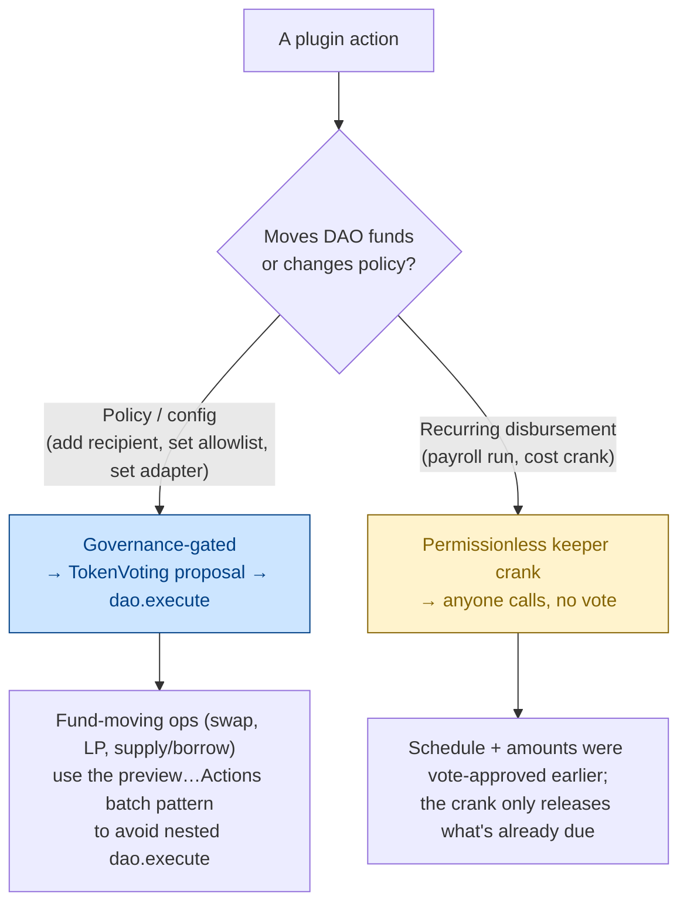
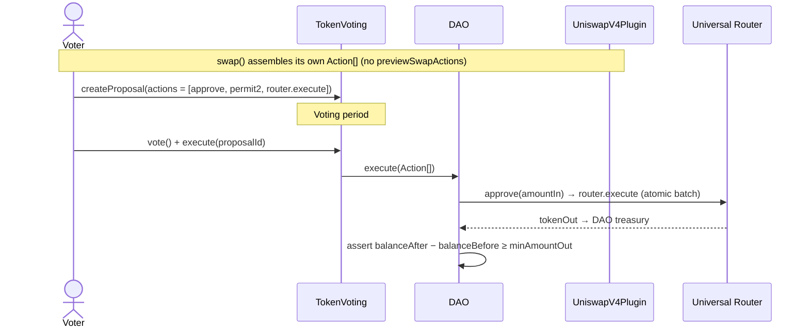
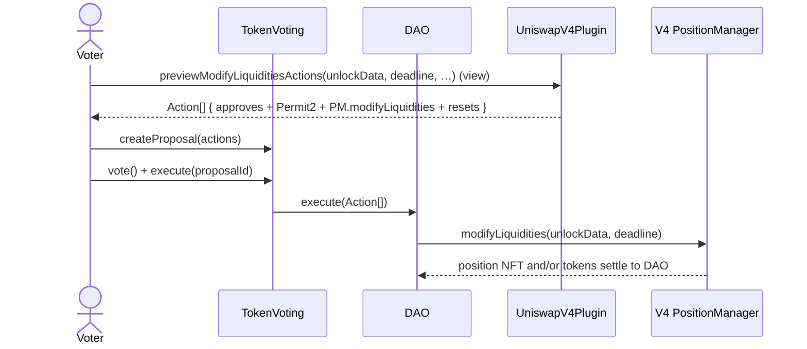
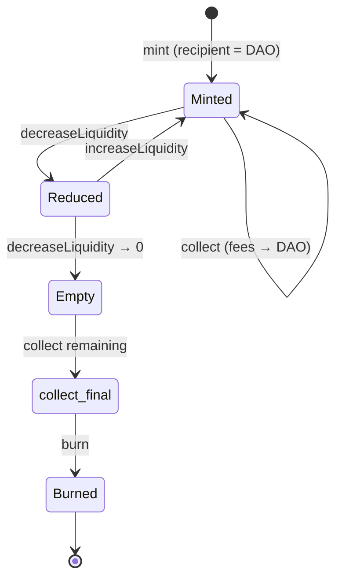
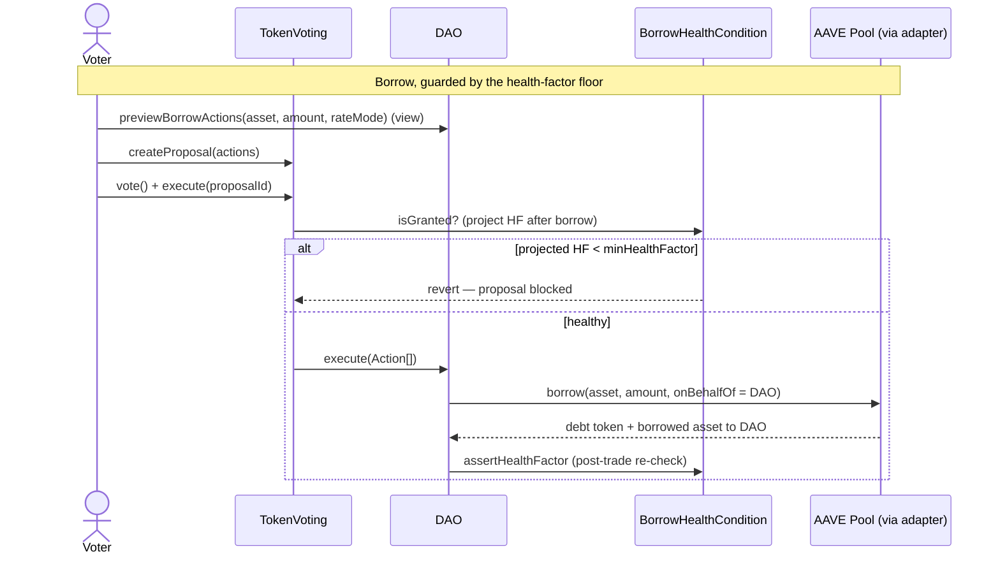
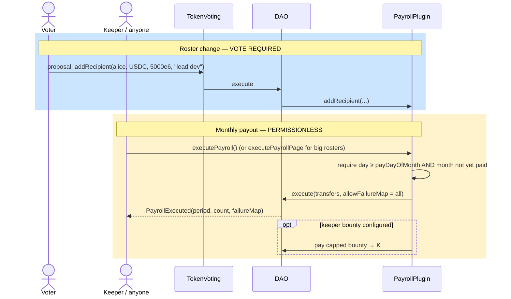
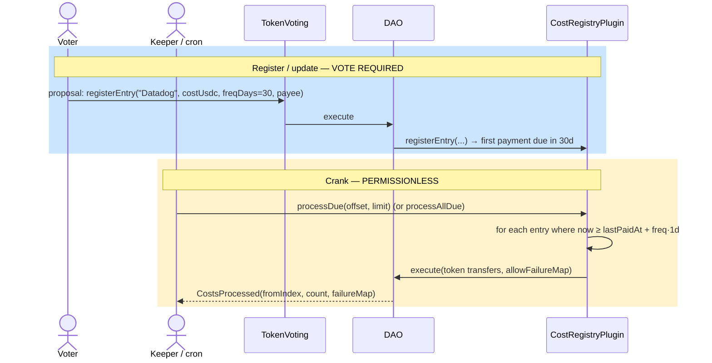

# Plugin Features & Use Cases

A capability-first tour of the five Cyberdyne DAO plugins. Where the per-plugin
spec files (`PAYROLL.md`, `UNISWAP_V4.md`, `UNISWAP_V3.md`, `AAVE.md`,
`COST_REGISTRY.md`) document storage layouts, slither waivers, and exact
signatures, **this doc answers "what can it do, and when would I use it?"** —
with worked scenarios and flow diagrams for each plugin.

- New to the project? Read the [README architecture section](../../README.md#high-level-architecture) first.
- Want the exact signatures / audit notes for one plugin? Jump to its spec file (linked per section).
- Want the design rationale for the governance path? See [TRD §9a](../TRD.md#9a-governance-path-action-builders-previewactions).

---

## The two interaction models

Every plugin action falls into one of two buckets. Knowing which bucket an
action lives in tells you who can call it and how.

**Why the `preview…Actions` pattern exists:** OSx's `DAO.execute` is
`nonReentrant`. A proposal that called `dao.execute([{to: plugin, data:
swap(...)}])` would make the plugin call `dao.execute` *again* (to move funds),
tripping the guard. So fund-moving wrappers ship a `view` sibling
(`previewSupplyActions`, `previewMintActions`, …) that returns the raw
`Action[]` the wrapper *would* have forwarded. The proposal carries that batch
directly, so the outer `dao.execute` runs it with no nesting. The plain
wrappers (`swap`, `mint`, `supply`, …) still work for tests and alternate
governance plugins.

---

## Capability matrix

| Capability | UniswapV4 | UniswapV3 | AAVE | Payroll | CostRegistry |
|---|:--:|:--:|:--:|:--:|:--:|
| Token swaps | ✅ | — | — | — | — |
| LP mint / increase / decrease / collect / burn | ✅ | ✅ | — | — | — |
| Supply / withdraw collateral | — | — | ✅ | — | — |
| Borrow / repay debt | — | — | ✅ | — | — |
| Recurring scheduled payouts | — | — | — | ✅ (monthly) | ✅ (per-entry cadence) |
| Permissionless keeper crank | — | — | — | ✅ | ✅ |
| Token/asset allowlist | ✅ | ✅ | ✅ | — | — |
| Health-factor guardrail | — | — | ✅ | — | — |
| Native ETH payouts | — | — | — | ✅ | — |
| Keeper bounty incentive | — | — | — | ✅ | — |
| Versioned external endpoint (adapter / router swap) | ✅ router/PM | ✅ NPM | ✅ adapter | — | ✅ payment token |
| DAO custody (plugin holds nothing) | ✅ | ✅ | ✅ | ✅ | ✅ |

Common to **all** plugins: the DAO is `msg.sender` to every external protocol,
so all tokens, aTokens, debt, and position NFTs are owned by the DAO treasury —
plugins never custody funds.

---

## 1. UniswapV4Plugin — swaps + V4 liquidity

> Spec: [`UNISWAP_V4.md`](UNISWAP_V4.md)

### What it does

Gates two distinct Uniswap V4 capabilities behind DAO governance:

1. **Swaps** through the Universal Router (with Permit2), with an on-chain
   `minAmountOut` slippage guard checked against the DAO's real balance delta.
2. **Full LP lifecycle** (mint / increase / decrease / collect / burn) through
   the v4-periphery PositionManager via a `modifyLiquidities` pass-through.

### Feature highlights

- **Exact-amount Permit2 approval** — approves precisely `amountIn`, never
  `type(uint256).max`; allowance lands back at 0 after the router pulls.
- **Sticky token allowlist** — optional `tokenIn`/`tokenOut` (and every LP
  currency) gate. The first `setAllowedToken(_, true)` flips enforcement on
  permanently (one-way, by auditor request — no accidental un-enforcement).
- **DAO-recipient guard on mint** — decodes `unlockData` and reverts
  `MintRecipientMustBeDao` if any `MINT_POSITION` carries a non-DAO owner, so a
  position NFT can never be minted to an attacker.
- **Migratable endpoints** — `setUniversalRouter` and `setV4PositionManager`
  (both vote-gated) let the DAO follow Uniswap deployments without a plugin
  upgrade. The PM may start unset (`address(0)`); LP ops revert until wired.
- **Per-op call-id nonces** — `swapNonce` and a separate internal `lpNonce`
  keep swap and LP execution histories from aliasing in the subgraph.

### Use cases

- **Treasury rebalancing** — DAO holds too much of one token; a proposal swaps
  a fixed amount into USDC with a slippage floor.
- **Provisioning protocol-owned liquidity** — mint a concentrated V4 position
  for the DAO's own token pair; the NFT lands in the treasury.
- **Harvesting LP fees** — `collect` routes accrued fees straight to the DAO.
- **Winding down a position** — `decrease` then `burn` to reclaim principal.

### Swap flow (governance path)

### LP flow (`modifyLiquidities` pass-through)

---

## 2. UniswapV3Plugin — full V3 LP lifecycle

> Spec: [`UNISWAP_V3.md`](UNISWAP_V3.md)

### What it does

Wraps the V3 `NonfungiblePositionManager` for the complete position lifecycle —
`mint`, `increaseLiquidity`, `decreaseLiquidity`, `collect`, `burn` — each with
a matching `preview…Actions` helper for the governance path. (No swaps; V3
swaps aren't in scope — use V4 for swaps.)

### Feature highlights

- **Forced DAO recipient** — positions always mint with `recipient = DAO`, and
  `collect`'s recipient is hard-forced to the DAO. NFTs and collected tokens
  can never be routed elsewhere.
- **Sticky token allowlist** — same one-way enforcement model as V4; optional,
  off by default, seedable at install via `_initialAllowlist`.
- **Migratable NPM** — `setPositionManager` (vote-gated) tracks NPM
  redeployments without a plugin upgrade.
- **ERC20-only, no payable surface** — to LP with ETH, wrap to WETH in the same
  proposal (`WETH.deposit` action); the plugin never holds a payable entry point.
- **Monotonic `opNonce`** — unique call-id per operation for clean event
  indexing.

### Use cases

- **Concentrated liquidity for a stable pair** — mint a tight USDC/USDT range
  to earn fees with minimal IL.
- **Laddering liquidity** — `increaseLiquidity` on an existing position as the
  treasury grows, rather than fragmenting into many NFTs.
- **Fee sweeps** — periodic `collect` proposals route trading fees to treasury.
- **Exit** — `decreaseLiquidity` to 0 then `burn` to clean up the NFT.

---

## 3. AaveLendingPlugin — lending & borrowing

> Spec: [`AAVE.md`](AAVE.md)

### What it does

Gates AAVE money-market actions — `supply`, `withdraw`, `borrow`, `repay` —
behind governance, with `onBehalfOf = DAO` on every call so aTokens and debt
tokens are always issued to the treasury. A version **adapter** abstracts the
pool ABI so the DAO can migrate v3 → v4 by vote, not by redeploy.

### Feature highlights

- **Adapter abstraction** — `AaveV3Adapter` is live today; `AaveV4Adapter` is a
  stub (`NotImplemented` until v4 ships). `setAdapter(newAdapter)` (vote-gated)
  swaps the routing. Adapters are stateless calldata-builders; the DAO calls the
  pool directly.
- **Health-factor guardrail** — `BorrowHealthCondition` enforces a
  governance-settable `minHealthFactor` floor (18-dec, e.g. `1.5e18`). It gates
  borrows two ways: `isGranted` projects the post-borrow health factor *before*
  the trade (permission condition), and `assertHealthFactor` re-checks *after*.
  Read-only `currentHealthFactor` / `projectedHealthFactorAfterBorrow` views let
  UIs preview headroom.
- **Exact-amount approvals with dust reset** — `supply` is a 2-action batch
  (approve + supply); `repay` is a 3-action batch that resets the allowance to 0
  afterward in case the pool pulled less than requested. `withdraw`/`borrow`
  need no approval (the pool pushes to the DAO).
- **Asset allowlist** — `setAllowedAsset`, same sticky one-way model as the
  Uniswap plugins.

### Use cases

- **Earn yield on idle stables** — `supply` USDC, receive aUSDC into treasury.
- **Leverage without selling** — `supply` collateral, then `borrow` against it,
  bounded by the health-factor floor so a proposal can't over-leverage.
- **Deleveraging** — `repay` debt then `withdraw` collateral.
- **Protocol migration** — when AAVE v4 launches, pass a proposal calling
  `setAdapter(aaveV4Adapter)`; new ops route to v4 while legacy positions stay
  on the old pool.

---

## 4. PayrollPlugin — automated monthly payroll

> Spec: [`PAYROLL.md`](PAYROLL.md)

### What it does

Maintains an on-chain recipient list and pays every active recipient **once per
month** on a fixed day. Roster changes are vote-gated; the monthly payout itself
is a **permissionless crank** anyone can trigger on or after the pay day.

### Feature highlights

- **Vote to manage, anyone to pay** — `addRecipient` / `removeRecipient` /
  `setAmount` / `setPayDayOfMonth` / `setMaxRecipients` need a proposal;
  `executePayroll()` does not.
- **Per-recipient description** — `addRecipient(payee, token, amount,
  description)` and `setRecipientDescription` attach a human label (e.g.
  "Alice — lead dev"), surfaced via `RecipientAdded` /
  `RecipientDescriptionSet` for UIs.
- **Native ETH or ERC20** — `token = address(0)` pays ETH.
- **Failure isolation** — per-action `allowFailureMap`; one reverting payee
  (e.g. a frozen token) doesn't block the rest of the run.
- **Pagination** — `executePayrollPage(maxCount)` walks large rosters
  (`MAX_RECIPIENTS_PER_PAGE = 100` per page); `payoutCursor` / `cursorPeriod`
  track progress, `PayrollPeriodCompleted` fires when the month is fully paid.
- **Settable cap** — `MAX_RECIPIENTS()` defaults to 300, raisable to the
  `MAX_RECIPIENTS_CEILING` of 1000 without a plugin upgrade.
- **Keeper bounty** — optional `setKeeperBounty(token, perCrank, maxPerPeriod)`
  pays the crank caller a capped bounty so keepers stay incentivized on
  high-gas days.
- **Force back-pay** — `previewForcePayPeriodActions(period)` lets governance
  settle a missed month (bounded by `MAX_FORCE_BACK_MONTHS = 12`).
- **Safe calendar math** — `payDayOfMonth` constrained to 1–28; dates via the
  vendored BokkyPooBah DateTime library.

### Use cases

- **Contributor salaries** — a fixed monthly USDC stipend per contributor,
  paid automatically without a vote every month.
- **Grantee stipends in ETH** — recurring ETH disbursement to a research grantee.
- **Onboarding/offboarding** — one proposal adds or removes a contributor; the
  schedule and amounts persist between votes.
- **Catch-up** — the DAO forgot to crank in March; a force-pay proposal settles
  the missed period.

---

## 5. CostRegistryPlugin — recurring operating costs

> Spec: [`COST_REGISTRY.md`](COST_REGISTRY.md)

### What it does

A registry of recurring vendor/operating costs (e.g. "Datadog", "AWS"), each
paying a fixed amount on its **own independent cadence**. Registering/editing
entries is vote-gated; disbursing due entries is a **permissionless crank**.

### Feature highlights

- **Independent per-entry cadence** — each entry pays when `block.timestamp ≥
  lastPaidAt + frequencyDays`. No shared period: a 30-day SaaS bill and a 7-day
  service run on their own clocks.
- **Vote to register, anyone to pay** — `registerEntry` / `updateEntry` /
  `removeEntry` / `setMaxEntries` need a proposal; `processDue(offset, limit)`
  and `processAllDue()` are permissionless.
- **Clock-preserving updates** — `updateEntry` keeps `lastPaidAt`, so editing an
  amount doesn't reset the schedule or trigger an early payment.
- **Failure isolation + pagination** — `processDue` pays a window with a
  page-local `failureMap`; `MAX_PER_PAGE = 100` (256-bit bitmap bound).
- **Defense-in-depth cap** — `MAX_COST_USDC` ($1B in raw units) guards against
  a typo'd amount draining treasury.
- **Migratable payment token** — `setPaymentToken` (separate
  `UPDATE_PAYMENT_TOKEN_PERMISSION`); note `costUsdc` is raw units, so a decimals
  change must be paired with `updateEntry` calls in the same proposal.
- **Settable cap** — `MAX_ENTRIES()` defaults to 300, raisable to 1000.
- **Rich introspection** — `getEntry`, `getEntries` (paginated), `isDue`,
  `nextPaymentAt`, `entryCount` for UIs and keepers.

### Use cases

- **SaaS subscriptions** — register Datadog at $X every 30 days; a keeper cron
  cranks `processAllDue()` daily and only due entries pay.
- **Mixed cadences** — a monthly audit retainer and a weekly infra bill coexist,
  each paying on its own schedule.
- **Repricing** — vendor raises their price; `updateEntry` changes `costUsdc`
  without disturbing the next due date.
- **Decommissioning** — `removeEntry` soft-deletes a cancelled service (slot
  kept for history; never paid again).

---

## Where to go next

| You want… | Read |
|---|---|
| Exact signatures, storage layout, slither waivers for one plugin | The matching spec in this folder |
| The governance preview-action pattern in depth | [TRD §9a](../TRD.md#9a-governance-path-action-builders-previewactions) |
| Every event → UI/subgraph mapping | [docs/EVENTS.md](../EVENTS.md) |
| How a frontend consumes these contracts | [docs/FRONTEND_INTEGRATION.md](../FRONTEND_INTEGRATION.md) |
| Threat model & trust boundaries | [docs/THREAT_MODEL.md](../THREAT_MODEL.md) |
| Run the whole stack locally | [docs/LOCAL_STACK.md](../LOCAL_STACK.md) |
